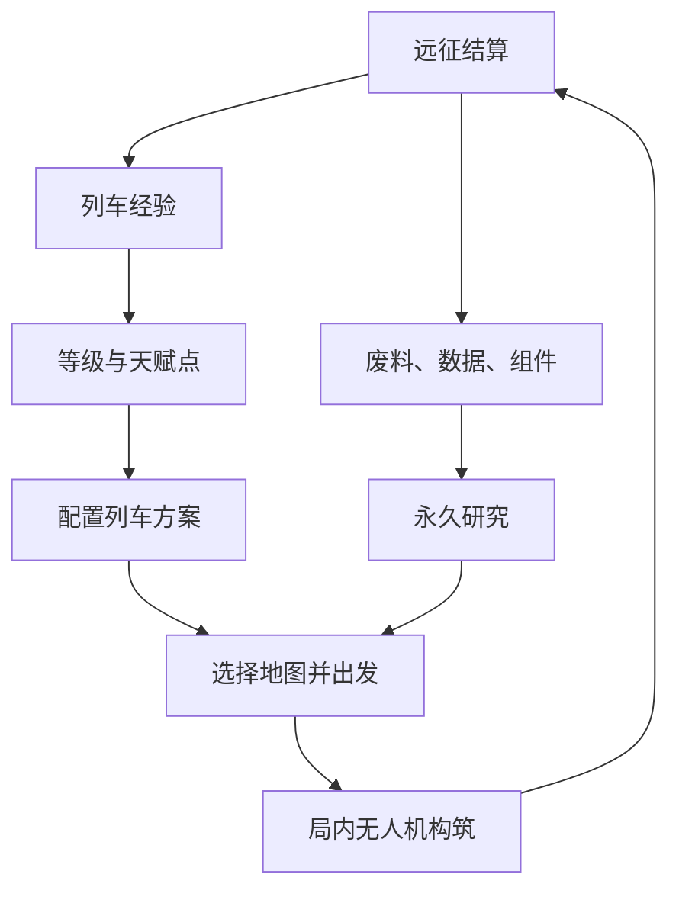

# Endless Rails v0.10.0：列车构筑与永久研究需求

文档修订：v1.1 · 2026-09-28  
适用项目：`ChrisGzzl/indie-trail` / `endless-rails/`  
版本主题：先完成局外成长，再围绕成长系统重做局内关卡。

本次节奏约束：自然恢复体力＋每日免费补给 1 次＋广告补给 2 次，正式远征每天最多 30 次。以连续 14 天、累计 420 次有效远征覆盖全部车厢、专精、60 点构筑和七项 Lv30 研究为完成目标。第 30～32 节给出具体计算与一次性保障规则。  
文档状态：需求与首轮调参基线。本文完成了规则补齐和纸面核算，尚未核对当前 main 的实际参数，也不代表已通过实玩平衡验证。

## 1. 版本结论

本次版本拆分成立。v0.10.0 集中解决两件事：

1. **可调整的列车构筑**：玩家用有限天赋点、车厢槽和互斥专精，组合本次远征的列车能力；可以保存和切换方案。
2. **可持续的永久研究**：玩家将远征资源投入无人机和列车基础属性；数值随研究等级增长，后期边际收益降低，后续版本可以继续开放等级。

下一大版本暂定 v0.11.0，负责动态速度、固定距离、敌潮导演、追击压力、地图和 Boss 节奏。

关键边界：v0.10.0 的构筑和研究必须在现有战斗中真实生效。只延期关卡重构，不能延期属性接入、伤害结算、车厢效果、存档与基础平衡回归。

## 2. 两个版本的职责

| 内容 | v0.10.0 | v0.11.0 |
|---|---|---|
| 列车等级与天赋点 | 重构并上线 | 继承 |
| 功能车厢解锁、强化、互斥专精 | 上线 | 随关卡扩展 |
| 改装预览、洗点、三套方案 | 上线 | 继承 |
| 无人机与列车永久研究 | 重构并上线 | 扩展并调参 |
| 局外资源收支与存档迁移 | 上线 | 延续 |
| 原有无人机升级、羁绊、突破 | 保持规则，接入研究倍率 | 根据新节奏调整 |
| 当前五段关卡 | 沿用现有关卡，按当前配置核实 60 秒/段 | 改为距离驱动 |
| 动力、质量、速度公式 | 不参与本版可购买能力 | 成套上线 |
| 距离威胁、追击压力、威胁队列 | 不改变当前生成逻辑 | 成套设计和验证 |
| 新地图、Boss 重构、环境挑战 | 不新增 | 主要内容 |
| 登车瘫痪、车厢损坏系统 | 不新增依赖 | 按挑战需要设计 |
| 体力与补给 | 自然恢复、免费一次、激励广告两次、每日30次上限 | 延续 |
| 其他广告、新无人机、新羁绊、装备随机词条 | 不做 | 独立排期 |

本版不展示看似可用的“高速 Build”，不出售尚未生效的动力天赋，不把预计抵达时间写成速度公式计算结果。保留现有可读的关卡进度表现。

## 3. 系统分工与循环

| 系统 | 玩家做的决定 | 生命周期 | 主要约束 |
|---|---|---|---|
| 列车天赋 | 开什么功能组合的车 | 局外配置，可调整 | 点数、车厢槽、专精互斥 |
| 永久研究 | 先投资火力还是生存 | 账号永久保存 | 废料、数据、组件 |
| 局内升级 | 本局无人机与羁绊组合 | 每局重新成长 | 当前局内升级规则 |



研究提高基础实力，列车构筑决定有限预算如何分配。同一账号的不同列车方案共享研究等级。

## 4. 本版必须形成的三种列车

| 参考构筑 | 投资重点 | 能力表现 | 明确放弃 |
|---|---|---|---|
| 火力支援 | 近防、战术雷达、部分车体 | 列车自身参与清怪，帮助处理精英 | 完整维修能力、仓储收益 |
| 重装续航 | 车体、维修、基础近防 | 高耐久、减伤、途中或到站恢复 | 高级雷达与资源收益 |
| 资源回收 | 仓储、勘探雷达、部分维修 | 更高资源收益与失败保留 | 顶级近防、完整车体专精 |

三种是验收样本，不是锁定职业。玩家可以混搭，不提供一键购买职业套装。

本版所有构筑沿用同一行进和关卡计时规则。高速、均衡、重装的速度差异移至下一版。

## 5. 列车等级与经验

### 5.1 点数与满级

- Lv1 初始 2 点，此后每级 +2 点，Lv30 共 60 点。
- 等级只提供点数、槽位与节点资格，不再直接增加无人机伤害，也不能用废料买级。
- 达到 Lv30 后仍保存累计 XP，不在本版自动兑换资源。
- 本次把旧稿 22,620 XP 的满级曲线重新标定；按每天 30 次出发，旧曲线约数天就结束，无法承接两周构筑成长。

### 5.2 前快后慢的经验需求

```text
从 LvL 升到 Lv(L+1) 的 XP = 150 + 200 × (L - 1)
Lv1 → Lv30 累计 = 85,550 XP
```

升级单次需求随等级增加，累计经验呈二次增长，实际等级体验不是每天固定升相同级数。

| 到达等级 | 累计 XP | 以每次通关240 XP计算的等效局数 |
|---|---:|---:|
| Lv3 | 500 | 2.1 |
| Lv5 | 1,800 | 7.5 |
| Lv8 | 5,250 | 21.9 |
| Lv10 | 8,550 | 35.6 |
| Lv15 | 20,300 | 84.6 |
| Lv18 | 29,750 | 124.0 |
| Lv20 | 37,050 | 154.4 |
| Lv25 | 58,800 | 245.0 |
| Lv30 | 85,550 | 356.5 |

### 5.3 远征经验

普通地图每完成一段发 40 XP，五段共 200 XP，通关再加 40 XP，完整局合计 240 XP。失败时保留已完成段 XP，当前段按有效进度折算，单段未完成最多39 XP；不重复领取。

模型中失败平均推进 60%，故平均失败收益为 120 XP。暂停、菜单和停站等待不推进 XP；本项不改局内无人机经验掉落。

标准情景两周约 89,100 XP，达到 Lv30。个体运气波动及低胜率由第32节满勤保障承接，不声称每个账号都会自然得到这个期望值。

## 6. 编组、解锁与生效规则

基础固定编组为车头和无人机机库，不占功能车厢槽；主无人机北辰及原有伴飞体系不因天赋重置而丢失。

| 列车等级 | 功能车厢槽 |
|---|---:|
| Lv1～7 | 2 |
| Lv8～17 | 3 |
| Lv18～30 | 4 |

规则：

1. 车厢先通过对应天赋解锁，才能装备；每种车厢最多 1 辆。
2. 点了车厢强化但未装备该车厢，效果不生效，界面明确提示。
3. 装备/拆卸已解锁车厢和调整顺序免费，只能在局外完成。
4. 本版不因空槽给予速度或资源奖励，也不加入重量惩罚；槽位是容量上限，不要求装满。
5. 车厢顺序只改变编组展示及已有空间位置，不新增车厢独立受击或瘫痪机制。近防位置若影响当前射程，预览应如实显示。
6. 新增车厢数量不应使手机画面遮挡关键目标；沿用现有镜头规则，必要时做适配，不启动镜头系统重构。

## 7. 天赋总体预算

v0.10.0 使用五个分支：车体、近防、维修、雷达、仓储。暂时移除原稿动力分支。

| 分支 | 同时可购买的最大点数 |
|---|---:|
| 车体 | 24 |
| 近防 | 24 |
| 维修 | 22 |
| 雷达 | 20 |
| 仓储 | 20 |
| 合计 | **110** |

上述 110 点已排除每组互斥专精中不能同时购买的另一项，不用不可达节点虚增天赋树规模。60 点只能覆盖约 55% 的有效树。

所有节点表内“费用”为每级费用；分支投入只统计本分支已生效、且符合前置的节点费用。角色等级和节点等级分别展示，避免把“列车 Lv12 可学”误看成“节点升到 12 级”。

以下数值为第一轮实现基线，必须配置化；节点职责和前置关系优先保持稳定。

## 8. 车体分支：24 点

| ID | 节点 | 等级数 × 每级点数 | 列车等级 | 前置 | 每级效果 |
|---|---|---:|---:|---|---|
| H1 | 车架强化 | 3 × 1 | 1 | 无 | 最大耐久 +4% |
| H2 | 冲击缓冲 | 3 × 2 | 5 | H1 至少 1 级 | 列车受到的直接攻击伤害 -3% |
| H3 | 结构加固 | 2 × 2 | 8 | H1 满级 | 最大耐久 +6% |
| H4 | 维修接口 | 2 × 3 | 12 | H3 满级 | 基础到站维修量 +5% |
| H5 | 车体专精 | 1 × 5 | 20 | 本分支已投入 19 点 | 二选一，见下表 |

| 车体专精 | 效果 |
|---|---|
| 移动堡垒 | 最大耐久额外 +16% |
| 应急储备 | 每局首次由伤害导致耐久降到 30% 或以下且仍存活时，立即恢复最大耐久的 18%；每局仅一次 |

车架、结构和移动堡垒的耐久加成在天赋层相加，满分支移动堡垒合计 +40%。冲击缓冲满级为 9%，不作用于扣除最大耐久的改装代价；本版没有此类新代价。

应急储备不是复活，致死伤害不触发。连续命中、恢复存档、暂停和重复渲染均不能重复触发。

## 9. 近防车厢：24 点

| ID | 节点 | 等级数 × 每级点数 | 列车等级 | 前置 | 每级效果 |
|---|---|---:|---:|---|---|
| N0 | 解锁近防车 | 1 × 1 | 1 | 无 | 可装备近防车 |
| N1 | 射界扩张 | 3 × 1 | 3 | N0 | 射程 +8% |
| N2 | 连续供弹 | 3 × 2 | 5 | N0 | 攻击间隔 -5% |
| N3 | 弹药强化 | 2 × 2 | 8 | N2 至少 1 级 | 伤害 +10% |
| N4 | 近防专精 | 1 × 4 | 12 | 本分支已投入 14 点 | 二选一 |
| N5 | 火力校准 | 3 × 2 | 20 | N4 | 伤害 +5% |

基础车沿用当前近防行为。原稿的射程 92、单发伤害 0.8、间隔 0.42 秒先视为待代码核实的候选基线；射程使用当前世界单位，不是屏幕像素。若 main 不同，先记录并保留当前基础手感，再调天赋增幅。

| 近防专精 | 效果 | 定位 |
|---|---|---|
| 拦截阵列 | 间隔再乘 0.85，伤害再乘 0.90；优先攻击射程内最接近列车的目标 | 清理贴近列车的敌人 |
| 重型近防 | 单发伤害再乘 1.35，间隔再乘 1.20；对现有精英标签敌人额外乘 1.15 | 高单发和精英处理 |

不以新增击退、登车单位或新敌人类型作为本版前置。两种专精必须在现有敌人中立即有作用。

列车近防独立统计伤害，不归入雨燕或北辰；不消耗局内无人机武器槽，也不触发无人机羁绊或突破。

## 10. 维修车厢：22 点

| ID | 节点 | 等级数 × 每级点数 | 列车等级 | 前置 | 每级效果 |
|---|---|---:|---:|---|---|
| R0 | 解锁维修车 | 1 × 1 | 3 | 无 | 每次有效到站额外修复 12 点 |
| R1 | 高效维修 | 3 × 1 | 3 | R0 | 维修车恢复量 +8% |
| R2 | 通用零件 | 3 × 2 | 5 | R0 | 基础到站维修量 +5% |
| R3 | 备件扩容 | 2 × 2 | 8 | R1 满级 | 维修车固定到站修复额外 +2 点 |
| R4 | 维修专精 | 1 × 4 | 12 | 本分支已投入 14 点 | 二选一 |
| R5 | 维修协议 | 2 × 2 | 20 | R4 | 维修车恢复量 +8% |

| 维修专精 | 首轮基线 | 取舍 |
|---|---|---|
| 到站大修 | 每次有效到站，额外恢复最大耐久的 4% | 必须撑到车站，容易出现溢出治疗 |
| 行进抢修 | 每累计 10 秒有效行进战斗时间，恢复最大耐久的 0.5% | 途中持续生效，总量随有效战斗时间变化 |

以 4 次中途到站、300 秒行进战斗估算，专精基础总量分别为 16% 和 15%，再统一应用维修车及研究倍率。此处仅为纸面比较，最终比较实际有效治疗和途中存活率。

“有效到站”指一次实际站点结算，不包括重复打开界面，不包括已通关后没有战斗意义的终点恢复。首轮接入前核实当前地图实际中途维修次数。

暂停、三选一、车站菜单、断线等待不累计行进抢修时间；余数在同一局的各路段间保留。重开一局清零。

## 11. 雷达车厢：20 点

本版雷达采用已经能在战斗中兑现的拾取与资源功能，不售卖依赖未来 Boss 的情报能力。

| ID | 节点 | 等级数 × 每级点数 | 列车等级 | 前置 | 每级效果 |
|---|---|---:|---:|---|---|
| D0 | 解锁雷达车 | 1 × 1 | 5 | 无 | 局内经验拾取半径 +15% |
| D1 | 广域接收 | 3 × 1 | 5 | D0 | 局内经验拾取半径 +5% |
| D2 | 数据回收 | 3 × 2 | 8 | D0 | 研究数据结算收益 +3% |
| D3 | 雷达专精 | 1 × 4 | 15 | 本分支已投入 10 点 | 二选一 |
| D4 | 精密定位 | 3 × 2 | 20 | D3 | 局内经验拾取半径 +4% |

| 雷达专精 | 效果 |
|---|---|
| 战术标定 | 无人机与列车近防对现有精英标签敌人的伤害 +6% |
| 勘探分析 | 研究数据结算收益额外 +6% |

拾取半径加成作用于当前承担拾取的主体，不扩大无人机攻击射程或经验产量。不能因有多架伴飞无人机重复叠加；Lv30 满分支半径合计 +42%。

战术标定复用精英标签，普通敌人不享受该增幅；不新增标记动画和主动技能。Boss 是否属于精英标签必须统一定义，不能由多个模块各自判断。

所有玩家都可查看已经公开的地图基础难度和奖励。下一版再增加雷达的路线预测、预警等内容，避免“先装雷达看地图、再拆雷达配车”的操作负担。

## 12. 仓储车厢：20 点

| ID | 节点 | 等级数 × 每级点数 | 列车等级 | 前置 | 每级效果 |
|---|---|---:|---:|---|---|
| C0 | 解锁仓储车 | 1 × 1 | 4 | 无 | 失败时未锁定资源保留率 +20 个百分点 |
| C1 | 防震货柜 | 2 × 1 | 4 | C0 | 失败保留率 +4 个百分点 |
| C2 | 扩容回收 | 3 × 2 | 5 | C0 | 废料结算收益 +3% |
| C3 | 仓储专精 | 1 × 5 | 12 | 本分支已投入 9 点 | 二选一 |
| C4 | 组件分拣 | 3 × 2 | 20 | C3 | 技术组件结算收益 +2% |

| 仓储专精 | 效果 |
|---|---|
| 装甲仓 | 失败保留率额外 +10 个百分点 |
| 回收货柜 | 废料结算收益额外 +6%，失败保留率 -8 个百分点 |

如果当前基础失败保留率为 50%，满防震后装甲仓为 88%，回收货柜为 70%；所有来源叠加后的失败保留率上限为 90%。基础值若不同，应同步更新说明及示例。

失败保护只作用于未锁定的废料、研究数据和技术组件，不二次乘到已经入账的站点资源；不把蓝图、列车经验和局内经验当作可按比例拆分的货物。

## 13. 三套合法满级方案

三套方案均假设 Lv30、无蓝图随机门槛。以下为真实可购买点法，不只写方向名称。

| 方案 | 车体 | 近防 | 维修 | 雷达 | 仓储 | 合计 | 装备车厢 |
|---|---:|---:|---:|---:|---:|---:|---|
| 火力支援 | 16 | 24 | 0 | 20 | 0 | 60 | 近防、雷达 |
| 重装续航 | 24 | 14 | 22 | 0 | 0 | 60 | 近防、维修 |
| 资源回收 | 6 | 0 | 14 | 20 | 20 | 60 | 维修、雷达、仓储 |

具体配置：

- 火力支援：H1/H2/H3 满级、H4 1 级；近防全满选重型近防；雷达全满选战术标定。没有维修专精及仓储。
- 重装续航：车体全满选移动堡垒；近防 N0～N3 全满；维修全满选行进抢修。没有高级近防、雷达及仓储。
- 资源回收：H1 2 级、H2 2 级；维修 R0～R3 全满；雷达全满选勘探分析；仓储全满选回收货柜。没有近防及顶级车体、维修专精。

资源回收方案提供废料 +15%、数据 +15%、组件 +6%，并保留维修车的基础功能；这些是构筑收益加成，不是额外保证掉落数量。

低等级也应能选择，例如 Lv5 有 10 点，可购买少量车体和两种基础车厢。首个选择在最初几局出现，不需要等到 Lv20 才能开始构筑。

下一版加入动力树时须重新核算上述预算和默认方案，不直接把新树叠在现有强度上，也不自动增加天赋点上限。

## 14. 改装、洗点与方案保存

### 14.1 预览与确认

编辑时使用草稿，不直接扣费，不写入战斗状态。点选、撤销、重新分配和专精预览均免费，界面实时计算效果。

确认应用时一次性完成校验、扣费、点法、编组和存档更新；任一步失败均不保留部分结果。余额不足时保留草稿并显示差额。

### 14.2 费用

```text
仅增加新获得的未分配点：免费
只装备/拆卸已解锁车厢、调整顺序、改方案名称：免费
撤回已投入点或替换互斥专精：一次改装费用
改装费用 = 10 + ceil(列车等级 / 2) 废料
```

Lv30 为 25 废料，约为普通完整远征平均废料收益 110 的 23%。费用与当前已投入点数无关，不能通过先清空再切换获得优惠。

新账号或迁移完成后获得 3 次免费重构机会。只有真实发生付费类型的变更并确认应用时才消耗；取消预览、重复应用相同方案不消耗。v0.11.0 大规模调整天赋结构时应再次免费重构。

### 14.3 方案

提供 A/B/C 三个槽，允许重命名。每套保存：节点等级、专精选择、装备车厢及顺序；不保存研究等级和资源余额。

保存方案本身免费，应用时按差异判断是否收费。方案等级不足、前置失效或点数超限时，标记具体问题，允许编辑；不静默删点或强制扣费。

战斗开始时固化本局属性快照。局内不能切换方案；远征结算获得的新等级、研究和点数从下一局生效。

## 15. 永久研究的成长目标

研究只提供数值，不解锁新武器、羁绊、突破或车厢专精。

“可持续增长”采用分阶段可扩展等级，而不是本版无上限堆叠：

- Lv1～10：基础研究，每次升级有清晰提升。
- Lv11～20：进阶研究，继续增长但单级收益降低。
- Lv21～30：长期研究，给持续游玩的玩家稳定投入方向。
- v0.10.0 各研究当前上限为 Lv30；配置和存档支持后续扩展，超过 30 的费用与收益不在本版擅自外推。

所有研究从 Lv1 起开放，没有现实时间等待、每日强制限额或研究队列。数据足够即可升级；“永久”指升级不随远征或天赋洗点重置，不代表永远不能修正异常存档。

不要求七项全部升到30才能打通当前地图。全部研究Lv30是两周满额游玩的完成目标；功能节点更早开放，使玩家在毕业前有时间体验不同构筑。

## 16. 七条研究及收益曲线

定义 `a=min(L,10)`、`b=min(max(L-10,0),10)`、`c=min(max(L-20,0),10)`。

| 研究 | Lv1～10 每级 | Lv11～20 每级 | Lv21～30 每级 | 作用范围 |
|---|---|---|---|---|
| 火控算法 | 伤害 +1.5% | +0.8% | +0.5% | 北辰及所有无人机伤害 |
| 循环控制 | 间隔 -0.8% | -0.4% | -0.2% | 无人机普通攻击基础间隔 |
| 射程校准 | 射程 +1% | +0.3% | +0.2% | 无人机可校准的索敌/攻击射程 |
| 车体工程 | 最大耐久 +2% | +1% | +0.5% | 列车最大耐久 |
| 装甲材料 | 受伤倍率每级 ×0.99 | 每级 ×0.995 | 每级 ×0.9975 | 当前列车直接攻击伤害 |
| 维修工程 | 所有维修量 +2.5% | +1.25% | +0.75% | 基础到站、维修车、应急储备 |
| 列车火控 | 近防伤害 +1.5% | +0.8% | +0.5% | 列车自身近防，不影响无人机 |

原稿“系统加固”依赖车厢瘫痪机制，移至 v0.11.0 候选；本版用能立即生效的“列车火控”替代。未来新增系统加固应新建研究 ID，不悄悄替换玩家已购买的效果。

除装甲材料外，上表同一研究内的增幅相加。例如 Lv20 火控算法为 `1 + 10×1.5% + 10×0.8% = 1.23` 倍。

### 16.1 核算后的阶段效果

| 所有相关研究等级 | 无人机伤害 | 普攻间隔倍率 | 理论普攻 DPS | 射程 | 列车耐久 | 仅耐久/减伤计算的有效耐久 | 维修量 |
|---|---:|---:|---:|---:|---:|---:|---:|
| Lv10 | +15% | 0.92 | +25.0% | +10% | +20% | +32.7% | +25% |
| Lv20 | +23% | 0.88 | +39.8% | +13% | +30% | +51.1% | +37.5% |
| Lv30 | +28% | 0.86 | +48.8% | +15% | +35% | +60.9% | +45% |

理论普攻 DPS 为伤害倍率除以间隔倍率；不含射程带来的有效开火时间、羁绊触发、溢出伤害及场上目标不足。有效耐久不含维修，不能宣称等于整局生存提升。

本次修订有意放宽原稿“全研究最多约 +30% 攻击”的限制：该幅度仍适用于基础阶段附近，长期阶段允许更高成长。通过递减单级收益控制膨胀，不把长期研究压成几乎不可感知的数值。

## 17. 属性组合与伤害结算

同一属性只在规定层计算一次。服务端/存档派生值与前端预览使用同一套规则，不能分别实现两套公式。

```text
列车最大耐久 = 当前基础耐久 × (1 + 天赋耐久加成) × (1 + 研究耐久加成)
列车实际直接受伤 = 原始伤害 × (1 - 车体缓冲加成) × 装甲材料倍率
无人机伤害 = 当前局内基础伤害 × 火控算法倍率 × 合适的目标条件倍率
无人机普通攻击间隔 = 当前局内基础间隔 × 循环控制倍率
近防伤害 = 近防基础伤害 × (1 + N3/N5 加成) × 专精倍率 × 列车火控倍率 × 目标条件倍率
近防间隔 = 近防基础间隔 × (1 - N2 加成) × 专精间隔倍率
```

“当前局内基础伤害/间隔”保留已有武器等级、局内升级等计算，不能重复应用局外研究。现有最小攻击间隔限制继续生效，界面不承诺已经被下限吞掉的增益。

具体边界：

1. 火控算法覆盖无人机普攻、羁绊和突破伤害，但在最终伤害路径只乘一次。若羁绊取值已经来自研究后的普攻，不能再次乘研究倍率。
2. 循环控制直接改普攻间隔；羁绊若按普攻触发次数运作，可自然提高触发频率，但不额外降低羁绊自身限制；突破独立冷却保持原规则。
3. 射程校准不扩大爆炸半径、燃烧面积、跳弹次数和激光宽度；特殊武器无可缩放射程时，使用该武器明确支持的字段，列出适用性表。
4. 战术标定只对精英条件命中生效，多个伤害模块不重复加成。
5. 初始出战按本局最大耐久满血开始；修理不超过最大耐久，不把溢出转为护盾。

维修分层：

```text
基础到站维修 = 当前基础到站恢复量 × (1 + H4 加成 + R2 加成)
维修车到站维修 = (12 + R3 固定增量 + 大修百分比恢复) × (1 + R1 加成 + R5 加成)
实际到站维修 = (基础到站维修 + 维修车到站维修) × 维修工程倍率
行进抢修 = 最大耐久 × 0.5% × (1 + R1 加成 + R5 加成) × 维修工程倍率
应急储备 = 最大耐久 × 18% × 维修工程倍率
```

未装备维修车时，所有 R 分支收益均不生效；H4 和永久维修工程仍按其作用范围生效。

## 18. 研究成本：按420次远征重新标定

三项无人机研究主要用数据，四项列车研究主要用组件，七项共同消耗废料。

### 18.1 升到 Lv1～10 的单次费用

| 等级 | 每项废料 | 无人机主材料：数据 | 列车主材料：组件 |
|---|---:|---:|---:|
| 1 | 25 | 3 | 1 |
| 2 | 30 | 4 | 1 |
| 3 | 40 | 6 | 1 |
| 4 | 50 | 8 | 1 |
| 5 | 65 | 11 | 2 |
| 6 | 85 | 15 | 2 |
| 7 | 105 | 19 | 3 |
| 8 | 130 | 24 | 3 |
| 9 | 155 | 30 | 4 |
| 10 | 185 | 36 | 5 |
| 单项累计 | **870** | **156** | **23** |

无人机研究升至 Lv5/Lv10 额外消耗 1/3 组件；列车研究对应消耗 5/15 数据。

### 18.2 升到 Lv11～30 的单次费用

```text
L = 即将升到的研究等级，11 ≤ L ≤ 30
废料 = 185 + 7 × (L - 10)
无人机数据 = 36 + ceil(1.75 × (L - 10))
列车组件 = 5 + ceil(0.4 × (L - 10))
```

升到 Lv15、20、25、30 时，无人机研究每次额外消耗 3 组件，列车研究每次额外消耗 15 数据。

| 升到等级 | 废料 | 无人机数据 | 列车组件 |
|---|---:|---:|---:|
| 11 | 192 | 38 | 6 |
| 15 | 220 | 45 | 7 |
| 20 | 255 | 54 | 9 |
| 25 | 290 | 63 | 11 |
| 30 | 325 | 71 | 13 |

表中未包含里程碑交叉材料；界面展示最终总价。

### 18.3 全部七项累计费用

| 全部达到 | 废料 | 数据 | 组件 |
|---|---:|---:|---:|
| Lv10 | 6,090 | 548 | 104 |
| Lv20 | 21,735 | 2,048 | 426 |
| Lv30 | **42,280** | **4,073** | **908** |

收益递减曲线仍按第16节，费用逐步升高；每一点成长的获取时间和效果共同形成前快后慢。本次不把研究上限压回10级，七项30级均属于本版完整成长预算。

## 19. 资源收支与失败收益

### 19.1 普通完整远征

| 资源 | 过程奖励池 | 通关额外 | 完整局均值 | 模型通关掉落区间 |
|---|---:|---:|---:|---|
| 废料 | 90 | 30 | 120 | 100～140，整数均匀 |
| 研究数据 | 10 | 3 | 13 | 10～16，整数均匀 |
| 技术组件 | 2 | 1 | 3 | 2～4，整数均匀 |

完整局收益包含已经锁定的过程奖励，不能另加一遍。区间用于波动测试，生产配置可以使用等期望值的分段奖励；需核实当前奖励来源后统一账本。

新账号一次性初始资源：120废料、12数据、20组件。只发一次，不随卸载、刷新、迁移重复领取；存量账号使用既有投入承接，不另发多份新手包。

### 19.2 失败估算

基线假设：失败平均推进60%；已经获得的过程资源80%已锁定，剩余20%按50%保留。因此：

```text
失败资源 = 全程过程奖励池 × 60% × (80% + 20% × 50%)
平均失败：48.6废料、5.4数据、1.08组件
```

80%锁定份额是计算假设，不代表在代码里无视现有站点自动锁定80%。实现需按真实锁定时点回测，若平均份额不同则重算模型。通关奖励不在失败时发放。

组件等小数用固定精度余数累计，不能每局向下取整造成永久损失。基线未计雷达和仓储收益，资源构筑提供可选提前量。

### 19.3 非研究开销与消费边界

两周预留350废料用于改装等非研究消费，即每天平均25。免费重构次数继续保留，因此该预算有一定余量。其他旧商店/系统若仍强制消耗相同材料，必须先纳入预算，不能一边按全额资源计算研究，一边保留未统计的强制支出。

本版不新增数据/组件的强制研究外消费。玩家自主超额消费会延后实际买满时间，界面必须给出用途和价格。

### 19.4 标准两周预算

每天30次，前3天通关率65%，第4～7天75%，第8～10天80%，第11～14天85%；失败平均推进60%。这是待验证的设计假设，不是当前游戏实测胜率。

| 项目 | 两周预计 | 满级/满研究需求 | 余量 |
|---|---:|---:|---:|
| 列车 XP | 89,100 | 85,550 | 3,550 |
| 研究可用废料 | 43,208.5 | 42,280 | 928.5 |
| 数据 | 4,731 | 4,073 | 658 |
| 组件 | 1,092.8 | 908 | 184.8 |

资源预算含初始资源，废料已扣350非研究预留；不是消费后钱包余额。全研究需求含全部交叉材料。

技术组件和数据留有波动缓冲，废料是主约束。资源构筑、较高胜率可以提前完成；不额外设置第14天强制解锁门。

## 20. 收益与失败结算规则

1. 奖励使用出发时的列车方案快照，不能临近结算切换仓储套利。
2. 地图基础奖励乘地图系数，再乘相应车厢收益倍率；每个倍率只应用一次。
3. 已锁定资源全额保留，未锁定资源在失败时乘失败保留率；成功时不应用失败折损。
4. 资源收益加成不改变经验收益、广告次数或蓝图解锁概率。
5. 非整数资源使用固定精度余额累计，客户端显示整数可领取部分；中途锁定与终局结算共用同一账本，不能重复带入余数。
6. 每局使用唯一结算 ID，网络重试、刷新和恢复存档不能重复领奖；存档冲突不能把两份相同奖励相加。
7. 列车经验、资源、战绩和本局结算状态应一并提交。开发期静态存档模拟也应执行同样的单次结算规则。

## 21. 蓝图的本版定位

本版不让随机蓝图阻塞上述基础车厢、三种参考 Build 或核心专精。获得足够等级和点数即可构筑。

现有蓝图保留收藏与获得记录；当前已经生效的蓝图加成不能直接删除并假装无损迁移。实施前逐项登记：旧效果、获取/投入成本、是否进入新天赋或研究、补偿方式。

目标是结束旧蓝图与新研究对同一属性的重复永久叠加。能对应新能力的蓝图可保留外观/收藏展示和一次性研究资源补偿；实际补偿值按旧代码和获取成本确定，不能从本文示例臆造。

下一版可用指定地图首通或挑战奖励解锁扩展节点，随机掉落作为补充路径；核心构筑仍应有可预期的获取方式。

## 22. UI 与信息结构

沿用当前清爽、硬朗的 2D 科幻末日 UI 和底部导航，不启动全量视觉重做；新资源图标和面板与已有风格一致。

### 22.1 列车改装

顶部显示列车 Lv、升级进度、可用/总天赋点、当前方案；编组区显示已装备车厢和空槽。

中部使用“车体 / 近防 / 维修 / 雷达 / 仓储”分组切换。手机端不铺开一张过宽天赋树；每个分支展示清楚前置、费用、当前等级及专精互斥关系。

底部固定显示本次改装前后差异和应用按钮，例如最大耐久、近防伤害/间隔、维修量、资源加成与改装费用。未装备车厢的天赋标识为未生效。

速度、质量、动力不进入本版主面板，也不出现“购买后下版本生效”的付费节点。

### 22.2 研究

两个分类：无人机战斗（三项）和列车工程（四项）。每项显示当前等级、累计效果、下一级新增效果、资源总价和当前上限。

显示“升级后伤害 115% → 115.8%”比单独写“+0.8%”更清楚。装甲材料显示实际受伤降低比例，不把乘法叠加错误写成等级数对应的整百分比。

提供一次一级的升级按钮；按住升级、十连升级不是必做。资源不足时显示缺少数量。

### 22.3 出发与结算

出发页只展示当前列车方案摘要和研究增益摘要，编辑入口跳转对应页面。战斗 HUD 不新增一排局外天赋按钮。

结算保留无人机普攻/羁绊/突破伤害分类，追加列车近防伤害、有效维修量及资源加成收益。避免把溢出治疗计为有效修复。

战斗暂停面板应可查看本局实际属性；修改局外预览不能让已经开局的暂停面板变化。

## 23. 数据与实现边界

配置建议分开维护：等级经验曲线、天赋节点、车厢基础参数、研究效果、研究成本、奖励系数。界面不硬编码第二份公式。

账号至少保存：

| 数据 | 要求 |
|---|---|
| 存档结构版本与迁移版本 | 能识别旧存档，迁移完成可核验 |
| 列车等级、等级内 XP、累计 XP | 避免不同 XP 含义混用 |
| 当前天赋分配与方案槽 | 使用稳定节点 ID，不以中文标题作主键 |
| 当前装备车厢与顺序 | 与天赋解锁资格一致 |
| 七项研究等级 | 保存原始等级，派生属性运行时计算 |
| 资源及固定精度余数 | 不因多次取整损失收益 |
| 免费重构次数 | 与应用改装同次提交 |
| 结算 ID 与奖励状态 | 可防止重复入账 |
| 蓝图和原有进度、战绩 | 保留旧数据，迁移可追踪 |
| 活跃远征快照 | 属性、方案和配置版本明确 |

账号另需保存体力余额、最后恢复时间、日补给/广告/出发计数、奖励凭证、累计有效远征、成长保障领取状态及资源累计供给账本。

开发期继续沿用当前用户存档模拟方式。本版不同时引入十万用户规模数据库重构；新字段按用户隔离，并为后续服务保留清晰的数据结构。

## 24. v0.9 → v0.10 存档迁移

### 24.1 原则

先保存迁移前快照，再一次性生成新存档；验证成功后标记迁移完成。失败时保留旧存档可恢复。重复执行不能重复退款或发点。

保留废料、组件、数据、地图进度、战绩、蓝图收藏和设置。删除旧直接属性来源时，必须有对应的投入承接或补偿记录。

### 24.2 列车等级和 XP

旧等级不超过 30 时保留等级；按等级赋予总点数 `2 × 等级`，可用点数由合法默认方案占用后计算。

旧等级内 XP 按旧升级阈值换算为进度比例，再映射到新等级阈值，避免保留等级又重复计入完整历史 XP。如果旧字段实际是累计 XP，必须先按旧曲线拆解，不能直接套比例。

旧等级高于 30 时，本版战斗使用 Lv30；超出部分及历史 XP 保存到迁移档案，不偷偷丢弃或自行兑换。如果真实存在这种账号，发布前必须写出补偿/后续扩级承接规则。

旧版废料买级的价值以保留等级和天赋点承接，默认不额外重复退款；如旧可达等级与新点数价值明显不匹配，列为补偿审核项。

### 24.3 旧研究与蓝图

按旧实际升级价格逐级累计退款，包括旧研究消耗的全部资源类型，不仅退示例里的数据。

若旧研究逐级费用确认为 8、16、24 数据，则 Lv3 退款为 48 数据；若它们其实是累计费用，应按实际数据解释，不硬套 48。七项新研究从 Lv0 开始，退款到账后由玩家选择投资。

列车旧等级伤害加成、旧研究倍率和被替代的旧蓝图倍率必须从战斗计算中移除，不能新旧同时生效。

### 24.4 默认方案与老玩家体验

迁移后的账号不能直接变成“裸车”：优先将旧装备车厢映射到新解锁节点，在点数和等级允许范围内生成可解释的默认方案；剩余点数保持未分配。

若旧编组超过新槽位或点数不足，保留原编组记录，按近防、维修、仓储、雷达顺序生成合法起始编组，并明确提示可免费调整。旧车厢的已支付成本按旧账本退款/补偿，不直接消失。

所有迁移账号获得 3 次免费重构。升级后的首次出发引导玩家检查点数和研究，不默认强迫消费全部退款。

活跃旧版本远征：优先使用兼容的旧快照完成并仅结算一次。若当前技术不能兼容，应安全返回局外，保留已锁定收益并退还本次入场消耗，不写入失败战绩；采用哪种策略须在实现前固定。

## 25. 开发顺序

| 阶段 | 交付 | 通过条件 |
|---|---|---|
| v0.10.0-alpha.1 | 核对 main、worklog、旧数据；建立统一属性计算和迁移样例；接入七项研究 | 研究在预览、战斗、暂停和结算中一致，旧增益无重复 |
| v0.10.0-alpha.2 | 等级点数、五分支天赋、编组、专精、改装预览 | 点数与前置合法，三套满级方案可购买并真实生效 |
| v0.10.0-beta.1 | 方案槽、体力、免费/广告补给、资源经济、退款、迁移、移动端页面和伤害统计 | 完成成长闭环与30次上限验证，旧账号可继续玩 |
| v0.10.0 | 实玩回归、必要的小幅参数修正、文档和 worklog 更新 | 下节验收通过，main 与交付版本一致 |

按模块推进，每阶段保持可运行。实现阶段先读取 `exports/worklog.md`，完成验证后按项目既有要求提交 main；本需求修订本身不代表已经执行代码改动或发布。

## 26. 验收标准

### 26.1 规则正确性

- Lv1 为 2 点，Lv30 为 60 点；满有效树为 110 点，互斥项不重复计数。
- 点数不为负，不越等级购买，不绕过前置；撤回前置会在草稿中同步撤回依赖并显示返还点数。
- 未装备车厢不产生对应分支收益；相同车厢不能重复装备。
- 三套参考 Build 在等级、前置、槽位和 60 点预算内全部合法。
- 保存、切换、取消、免费追加点和付费重构不会重复扣费或重复返还。
- 研究 Lv0、10、20、30 与公式一致；间隔下限、百分比小数、修复上限处理正确。
- 羁绊与突破仍按现有规则触发，普攻/羁绊/突破/列车近防统计不混淆。
- 暂停、升级选择、车站等待不触发行进抢修刷治疗。
- 奖励、免费重构和迁移在刷新重试后不重复执行。

### 26.2 战斗与经济验收

统一使用相同账号研究、同一地图和相近操作；自动模拟或固定种子对照只用于辅助，必须有手机尺寸实玩。

| 验证组 | 目的 | 记录 |
|---|---|---|
| Lv5/10 低级构筑 | 早期选择是否有作用 | 升级间隔、可购买方案、资源短缺 |
| Lv30 三套 Build、研究 Lv10 | 核心构筑差异 | 通关率、剩余耐久、近防伤害、有效维修、资源/局 |
| 同一 Build，研究 Lv0/10/20/30 | 永久成长能否兑现 | 伤害、受伤、成长差异、当前地图是否完全失去压力 |
| 同账号成功局与失败局 | 仓储和结算价值 | 锁定收益、未锁定收益、保留率、余数 |
| 旧账号迁移前后 | 投入和可玩性是否承接 | 余额、属性来源、编组、重复加载 |

三种构筑应分别在其主指标上有稳定优势，同时付出可见代价；不能仅改面板而战斗结果几乎相同。统计每局收益和含成功率的平均收益，防止资源构筑失去代价。

首轮可使用每个构筑至少 10 个配对种子观察趋势；若差异模糊再扩大样本，不以 10 局宣称已证明长期平衡。

研究高等级使低难地图更容易是允许的。若导致所有构筑差异消失或当前最高难度也只剩等待，则优先降低后两阶段研究增幅或列车技能系数；不为保住纸面数值临时塞入整套新怪物系统。

### 26.3 UI、性能与交付

- 竖屏手机常见尺寸下，天赋、研究费用与确认按钮可读、可点，不横向溢出。
- 研究和天赋产生的属性变化在出发前可理解，玩家知道下一点能买什么。
- 同场景性能不因天赋预览或收益计算反复执行明显退化；战斗中使用已固化的属性。
- 现有浮动摇杆、暂停、三选一、音频开关、GM 等级调整和主要美术效果保持可用。
- GM 可以分别设置列车等级、资源和研究等级进行验证；GM 模拟的统计不得污染正常奖励记录。
- 发布版本号更新，迁移策略与已知限制记入 worklog；验证后再交付 main。

## 27. 下一版接续清单：v0.11.0

下列原稿内容整体迁移，旧数字保留为候选假设，不视为已经批准的最终平衡参数。

| 主题 | 原稿候选 | 下一版必须一起解决 |
|---|---|---|
| 固定距离 | 五段各 1,200m，总 6,000m | 到站、终点及残余敌人处理 |
| 动态速度 | 基准 20m/s，候选范围 15～30m/s | 与动力、质量公式一致；上下限不能吞掉正常构筑代价 |
| 动力树 | 引擎、轻量、涡轮、超速 | 与现有 60 点预算重新组合，迁移免费调整 |
| 距离敌潮 | 每 100m 分配威胁，候选 8 点 | 同距离经验供给、击杀机会和相对运动 |
| 时间追击 | 150 秒后开始，每 50 秒增加 | 定义是难度倍率还是独立追兵，以及暂停/停站时间 |
| 威胁队列 | 保存未生成预算 | 有上限、可核算，不因设备性能改变敌人性质 |
| 速度与成长 | 高速缩短单局 | 羁绊/突破达成时点与资源每分钟收益 |
| 地图和 Boss | 追逐、封锁、登车、环境 | 实际关卡差异，不只显示克制标签 |
| 雷达与蓝图 | 情报、特殊节点 | 基础地图信息公开，核心构筑不受纯随机门槛阻塞 |

不能仅把“时间进度条”替换成距离条就宣告完成速度玩法。速度、空间、怪物、经验、奖励和终点规则是下一版同一项完整设计。

## 28. 实施前必须核对的现有数据

本文已给出新系统的具体规则；以下属于未读取当前代码前不能臆造的旧系统事实。

| 项目 | 核对后需落入配置或迁移表 |
|---|---|
| 当前列车等级、XP 字段含义和升级费用 | XP 转换、旧买级投入承接 |
| 当前基础耐久、近防伤害/射程/间隔 | 新天赋实际作用的基准 |
| 实际中途站点次数及基础维修量 | 维修专精和有效恢复比较 |
| 现有失败保留率、资源锁定时机和来源 | 仓储公式及奖励防重 |
| 旧每项无人机研究的真实逐级成本 | 全额退款 |
| 蓝图旧效果、已付成本和装备记录 | 逐项迁移补偿 |
| 当前地图收益、体力与商店支出 | 完整经济收支 |
| 羁绊/突破伤害和精英标签实现 | 避免研究重复乘算 |
| 当前用户存档方式及活跃远征恢复能力 | 原子保存、兼容或安全中止策略 |

核对发现差异时，更新本表关联的配置及实例，再进入实现。不要用文档示例覆盖未知旧数据，也不要把未核对项当作已完成。

## 29. 本次相对原稿的主要调整

1. 将固定距离、速度、动力、重量和敌潮重构整体移到下一版，避免把两个大版本捆在一起。
2. v0.10.0 的列车构筑改为火力、续航和回收，保证所有可购买能力立即生效。
3. 完整列出节点费用、前置、互斥和三套 60 点合法方案，验证实际取舍。
4. 研究从 10 级短线扩展为 30 级三阶段成长，明确边际递减和后续扩级边界。
5. 重算三种研究材料需求，降低“数据和组件无处花、只卡废料”的风险。
6. 洗点改为较低固定等级费用，草稿免费预览；方案包含编组和专精。
7. 新增自然回体、免费补给一次、广告补给两次、每日30次上限；重算420局完整成长预算及一次性保障。
8. 调整维修专精基线，移除依赖未来玩法的无效节点，明确计时和结算范围。
9. 补齐研究叠加、奖励防重、旧存档补偿及版本衔接要求。

版本完成的判断：玩家能在局外主动组合一辆有取舍的列车，远征后有明确的研究投资方向，两套成长真实作用于当前游戏，且旧账号能够平稳继续游玩。


## 30. 体力、补给与每日出发上限

### 30.1 正式规则

| 项目 | 数值 | 可支持出发 |
|---|---:|---:|
| 每次正式远征 | 消耗10体力 | 1次 |
| 自然恢复 | 每8分钟1点 | 每24小时180点，18次 |
| 自然体力上限 | 180点 | 可存18次 |
| 新账号初始体力 | 180点 | 与自然上限一致，只初始化一次 |
| 每日免费补给 | 1次，每次40点 | 4次 |
| 每日激励广告补给 | 2次，每次40点 | 合计8次 |
| 长期每日预算 | 180＋40＋80＝300点 | 30次 |
| 每个游戏日的正式远征硬上限 | 30次 | 任何体力来源均不能突破 |

不看广告，长期每天自然恢复＋免费补给可支持22次；看满两次可支持30次。广告只补体力，不提高单局收益，不增加天赋点或研究倍率。

自然恢复上限是180；免费/广告补给允许溢出到300，不截断已承诺的40点奖励。当前余额超过180时暂停自然恢复，低于180后继续；总余额不足40点空间时不启动补给领取或广告，避免看完无法完整发奖。

一天30次是硬限制，不是仅靠自然恢复率间接约束。即使有初始体力、前日储备或将来发放的补偿，也不能在同一游戏日出发31次。

### 30.2 时间与结算

游戏日统一按服务器Asia/Shanghai每日05:00切换。自然恢复按连续时间计算，离线恢复到自然上限即可；每日刷新只重置次数，不额外赠送180体力，不把初始体力再算一遍。

满体力达到180以后不继续自然积存。模型按第一天初始180、后续每24小时有效恢复180计算，是不浪费回体的目标预算，不是所有领取方式都必然获得的实际收益。要稳定达到30次，应先消耗自然体力，再在余额低于140时分次领取40点补给；不要满体力时一次领完造成长时间溢出并暂停恢复。出发页应显示自然恢复暂停状态，并在体力不足时提供补给入口。集中游玩或跨刷新仍不能突破每日30次。

免费补给按成功发奖时所在游戏日扣减次数。广告资格在申请时预留，并绑定该游戏日及唯一奖励凭证；有效完成后消耗原申请日的资格，取消或失败释放预留。跨日回调不改记到新一天，超时凭证按服务端有效期处理；同一凭证不能重复发奖。

出发时原子扣10体力并增加当日出发计数；正常战败、主动退出不返还。加载前技术失败确认未进入战斗时，体力与次数一并返还一次；断线恢复同一局不重复扣除，也不另计一次。

### 30.3 激励广告的本版范围

本轮用户要求已覆盖原稿“本版不做广告”的安排：v0.10.0只实现体力广告补给，不同时加入复活、重抽、全选等广告场景。

生产发奖以广告平台有效完成回调/凭证为准，按账号和唯一凭证防重；取消、失败和无填充不扣领取次数、不发奖。奖励申请和体力空间在观看前检查，回调与同账号其他领取之间要避免竞争丢奖。

开发期可以使用清楚标记的模拟完成入口验证流程；生产广告接入未完成时，不能宣称每天30次广告补给已可用，也不能默认按420次收益发布两周承诺。该项属于正式发布门槛。

后续若落实累计观看后自动跳过广告的既定设想，跳过仍消耗每日2次补给资格，并受30次出发上限约束；不会变成无限体力。

## 31. 两周成长与非线性体验

### 31.1 标准满额路径

| 天数 | 累计出发 | 列车等级 | 天赋点 | 七项可均衡达到的研究等级 | 体验目标 |
|---|---:|---:|---:|---:|---|
| 第1天 | 30 | 8 | 16 | 7 | 开放基础车厢和第三槽，快速尝试组合 |
| 第3天 | 90 | 14 | 28 | 11 | 进入近防、维修、仓储专精选择 |
| 第7天 | 210 | 21 | 42 | 19 | 所有等级门槛开放，开始反复调整成熟构筑 |
| 第10天 | 300 | 25 | 50 | 24 | 补全主构筑，后期每点提升更小 |
| 第14天 | 420 | 30 | 60 | 30 | 全部功能与研究完成预算，三套完整参考方案可切换 |

“均衡研究等级”表示累计预算足以同时购买七项到该等级，不是玩家必须按相同顺序升级。两次均衡等级里程碑之间，仍可以购买部分单项升级。

首次完整构筑和专精必须在毕业前开放。不能把关键玩法藏到第14天最后一局才让玩家看到。

本版前快后慢由三件事共同构成：列车累计经验二次增长、研究单级成本提高、研究单级效果分段降低。不要额外把菜单等待或广告等待当作成长内容。

### 31.2 不同玩家的第14天

| 情景 | 累计出发 | 列车Lv | 均衡研究Lv | 说明 |
|---|---:|---:|---:|---|
| 标准，30次/日 | 420 | 30 | 30 | 通常自然完成，差额有保障 |
| 全胜，30次/日 | 420 | 30 | 30 | 可能提前完成，不故意卡日期 |
| 50%胜率，30次/日 | 420 | 28 → 30 | 26 → 30 | 箭头为420次保障补足后的结果 |
| 不看广告，22次/日 | 308 | 26 | 25 | 全功能已开放，完整毕业约18～20天 |
| 轻度，15次/日 | 210 | 21 | 19 | 全功能门槛已开放，完整毕业约26～28天 |

不看广告和轻度路径的完成天数按后续胜率保持85%估计；420次保障分别最早第20天和第28天触发。低胜率、漏玩或额外消费会改变自然完成时间。

### 31.3 每日时间

按通关5分钟、失败3分钟、每局升级/局外操作0.75分钟计算：标准满额两周约2,220分钟，即37小时，日均约159分钟；全胜满额约173分钟/日。另加实际两次广告观看时间。

因此30次应定位为重度玩家上限，不是所有用户的日常义务。每天15次也约79分钟，22次约116分钟。后续若想覆盖每日30～45分钟的轻度用户，应降低单局时长或降低完成所需局数，不能只提高体力上限。

### 31.4 随机波动检查

使用20,000个模拟账号、固定种子928100，每个账号420次远征；胜率按标准分段输入，成功资源使用第19节整数区间，失败推进随机取40%/60%/80%，等概率。

在不发保障补差前，模拟约99.955%达到列车Lv30，约92.3%有足够材料把七项研究全升至30；其余主要卡废料。该结果只检查给定胜率和掉落假设下的经济波动，不证明当前关卡实际有相同胜率，也不证明两周留存。

加入第32节保障后，所有完成420次有效远征、且非研究消费不超出预算的模拟账号均具备完成全部成长的条件。平均废料补差约24，列车XP补差均值不足1；低胜率账号会需要更多补差。

计算表提供标准、全胜、50%胜率、不看广告、轻度五种可切换情景；修改参数会重新计算同一套日成长模型。

## 32. 420次有效远征的一次性成长保障

### 32.1 为什么需要

仅给期望值不能兑现“肯定体验完”。胜率和掉落会使少数玩家在两周后仍差最后几次升级。本版用一次性累计远征保障处理尾部差异，不把平常每局收益全部改成相同数量。

触发条件：账号累计完成420次有效正式远征，且未领取本版保障。每日最多30次，因此最早在第14个游戏日触发；按实际出发游戏日计数，不能靠一场跨日战斗重复计入。

有效远征：正常通关，或正常战败且累计有效战斗至少60秒。主动放弃、加载失败退款、GM模拟、重复结算均不计。次数消耗与保障有效次数分别记录。零操作提前退出不属于“玩满”。

### 32.2 补足方式

列车XP一次性补至至少85,550累计有效成长XP，已有更多XP则不补。

资源按**累计供给**计算，不按当前钱包余额退款：

```text
废料累计供给目标 = 42,280研究费用 + 350改装等预留 = 42,630
数据累计供给目标 = 4,073
组件累计供给目标 = 908
补差 = max(0, 对应目标 - 本成长周期累计合格供给)
```

合格供给包含本周期新手包、远征最终保留资源、活动/补偿中确实可用于研究的同种材料；不重复计锁定和终局入账，不把退款和玩家之间循环转移计作新供给。现有账号迁移时，已有研究投入及可用余额按同一价值口径计入一次承接起点，不能既退款又重复登记。

囤着不研究与已经花在研究上的账号得到相同补差，先研究不会吃亏。领取后不返还此前研究消耗，不自动替玩家分配研究，玩家可用补足的材料完成剩余升级。

若玩家自行把超过350废料花在研究之外，或将数据/组件用于可选外部消费，额外支出不会由保障报销。正常主线没有超额强制消费，这是“可支付全部成长”的预算前提。

补差按固定精度精确入账，与日常资源余数共用账本；需要整数发奖的渠道向上取整，禁止截断导致仍差最后一个材料。领取凭证唯一，四项补差和完成标记一次性写入，重试不重复发奖。

50%胜率示例：两周自然预算约75,600 XP、35,176废料、3,876数据、876.8组件；保障约补9,950 XP、7,104废料、197数据、31.2组件。标准账号多数无需补差。

### 32.3 保障验收与版本限制

- 校验419次不领取、420次可领取、重复领取无效、跨日与断线只计一次。
- 所有节点无需随机蓝图门槛，420次后60点足以组成并体验任意参考方案；不要求同时买满110点天赋树。
- 保障覆盖本版七项Lv30研究，不自动覆盖未来新增研究和扩级费用。
- 记录实际有效局数、完成时间分布、自然毕业率和补差占比。若大量标准玩家依赖大额保障，先修正难度/基础收益，不能让保障变成唯一成长来源。
- 两周是供给与成长完成目标。当前地图能否支撑约37小时重复游玩，仍需实玩验证；下一版的关卡变化仍然必要。
