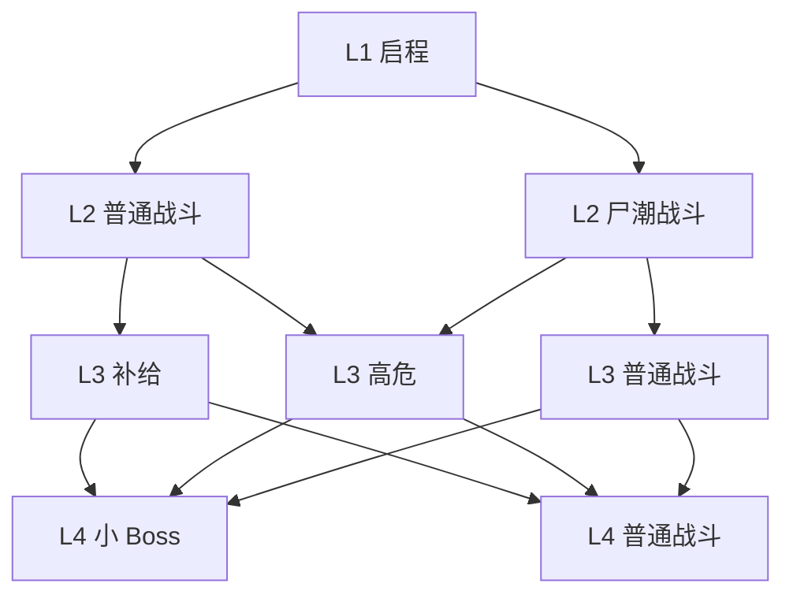
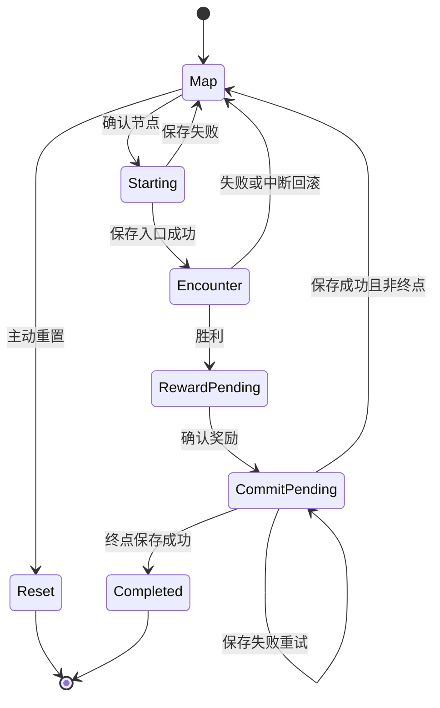

# Endless Rails v0.12.0：远征地图与局内玩法重构规划

文档版本：v0.3 · 2026-10-01 · 已核对 GLM 审核意见并修订  
代码基线：ChrisGzzl/endless-rails / main / v0.11.1.0 / e1fea0b45e6c19d4b11fe583104f5bae8c81bd22。该版本已包含 v0.11.0.1 的 Canvas 界面与按钮居中修复，并加入启动加载优化和“电球”更名。  
版本主题：把局外构筑接入有路线、有风险收益、有机制变化、可以分次完成的铁路远征。

**文档性质：对照当前源码的产品需求与实施规划；本次修订文档，不修改游戏代码或推送仓库。** 已读取 AGENTS.md、README.md、export/worklog.md 及入口、主页控制器、模拟、长期成长、云存档关键路径。当前代码事实以本次固定提交为准；v0.12 系列的新玩法、奖励数值和体力规则仍是待实施设计；§20 明确最小内部验证切片与各次交付范围，§24 记录审核结论及定向实测。旧需求中暂定 v0.11 的关卡重构顺延至 v0.12。

## 0. 当前已实现能力与必须继承的边界

源码基线：[main 本次核对提交 e1fea0b](https://github.com/ChrisGzzl/endless-rails/commit/e1fea0b45e6c19d4b11fe583104f5bae8c81bd22)。以下是源码事实，不是待建设项。

| 当前能力 | 已核对实现 | v0.12 接入约束 |
|---|---|---|
| 唯一入口 | index.html → src/main.js → canvas-host.js；网页与小游戏共用 | 延续一块 Canvas，不恢复 DOM 面板或旧 canvas.html |
| 主页导航 | 商店 / 列车 / 出发 / 研究 / 设置；出发居中突出 | 不新增地图 Tab；远征地图从现有出发页进入 |
| 出发调用 | homeCtl.start → 云冲突检查 → loadMeta → planFor → host.startRun → beginRun | 在控制器内增加新建/恢复地图分支；开始单个节点另设初始化，不能每次调用 beginRun 全量重置 |
| 列车升级 | 废料手动购买整级，Lv30 上限；Lv1→2 为 71，累计 21,273 废料 | 不恢复局外 XP 或自动升级；保持“升级至 Lv.N”、费用缺口和灰态 |
| 改装台 | 概览与改装台分层，五分支，三套草稿方案，应用才生效 | 地图/重试读取已应用方案，不读取未提交草稿；沿用退出草稿保护和改装费用 |
| 改装点 / 槽位 | 每级 2 改装点；Lv1–7/8–17/18–30 对应 2/3/4 功能槽，机库固定 | 不更改点数、槽位或称呼，不追加尚未设计的动力分支 |
| 永久研究 | 三项无人机、四项列车研究，Lv0～30；废料加数据/组件；七项满级废料合计 21,196 | 不改购买成本、效果曲线、两组卡片和当前/下级属性对照 |
| 属性计算 | buildStats 单源，createRun 生成 stats，战斗读 state.runStats | 复用计算器；新战术效果不能把永久研究乘两遍 |
| 区域 | 起始荒原、废墟城市、工业区、感染区，已有解锁链、通关次数与修复状态 | 保留四区域入口和旧解锁进度；不能把老玩家已解锁区域重新关闭 |
| 无人机 | 八种专机，加北辰与雨燕僚机；雨燕有免费 Lv1 | 保留机体 ID、编队和起步雨燕，不按旧六机清单删除内容 |
| 护盾 | shieldReady 布尔值，抵挡一次撞击，没有数值盾条 | 不引入护盾容量/比例/恢复百分比；沿用每轮一次抵挡与就绪状态，不出售不存在的盾容量 |
| 保存 / 防重 | meta v3，旧 key 保持；settledRunIds 已持久防重，失败写入可重试 | 扩展既有机制，不重新建设另一套账号档或忽略现有防重 |
| 未实现项 | 体力、每日上限、局外商店商品；动态列车速度 | 分别列为新增工作，不能称为已上线；远征商店与局外商店分开 |

### 0.1 研究与武器名称以当前版本为准

永久研究七项：火控算法、循环控制、射程校准、车体工程、装甲材料、维修工程、列车火控。使用现有 ID 和 buildStats 字段，不增加一套平行研究公式。

| 机体 | 武器 / 模块 ID | 当前等级规则 |
|---|---|---|
| 北辰 | command | 固定基础等级 1；主机星脉炮与羁绊攻击 |
| 雨燕 | gun / rapid | 显示等级 = 1 + modules.rapid；gunDisabled 时为 0 |
| 白虹 | piercing | 显示等级 = modules.piercing |
| 天隼 | missile | 显示等级 = modules.missile |
| 烛龙 | incendiary | 显示等级 = modules.incendiary |
| 惊蛰 | chain | 显示等级 = modules.chain |
| 回响 | ricochet | 当前文案为“电球”，内部 ricochet 不改名 |
| 弦月 | blades | 青色旋刃，保留 |
| 繁星 | scatter | 青色霰弹，保留 |
| 雨燕僚机 | wingman / escort0～2 | 现有上限三架，保留 |

蓝/红/紫三组有真实羁绊，青色当前仅为编组配色，不能在本版文案中虚构第四羁绊。Lv10 已有强化皮肤与效果，天隼 cluster/heavy、白虹 focus/split 已有二选一突破分支，新战术池不能再当作未实现机制重复提供。

### 0.2 接入流程与现有能力的迁移

当前流程是“出发 → 契约选择 → 当段路线事件 → 60秒战斗 → 清站 → 到站三选一 → 下一段”，整局五段。新版本用持久地图替代逐段路线事件选择，用补给/商店/事件替代站点大升级，但不删已有契约与模块能力。

- 保留契约 ID 与战斗风险参数，在 L1 选择一次并持续保存。奖励侧重映射：scrapMultiplier 只乘战斗节点远征券，rewardMultiplier 只乘战绩评分；二者均不乘永久预算 B。详见 §12.1，旧作用对象与新设计不可混称。
- 现有 routeEvents / applyRouteModifiers 可复用为节点词条输入，旧 routeChoice 不再作为地图之后的第二次路线选择。
- armor、repair、shield、volatile 是现有正常车站可获取能力，可转入商店/事件并保留 ID。overclock 虽在 upgradePool 有定义且脉冲代码读取它，但不在 experiencePool 或 stationUpgradePool，没有正常获取途径；若恢复为商品，必须列作新增内容，首个切片不默认复活。
- 局内 armor 的耐久加成需随 modules 保存；下一节点基础最大耐久 = 当前 buildStats.maxHp + 已有局内装甲的合法加成，再统一叠加本版临时效果。不能刷新研究快照后丢掉先前装甲模块加成。
- 跨节点保存 coreStacks、突破分支、已用应急储备、武器/羁绊/突破统计；清场仅清敌人、弹体、临时特效与本节点时钟，不把整轮构筑当作新开局。
- 本版只保留一个 activeExpedition。切换主页所选区域仍可浏览四区域，但已有远征继续按钮明确显示存档所属区域；新建另一图须先完成或主动重置，不静默覆盖旧图。

## 1. 版本目标与设计分工

当前优先解决三个体验问题：

1. 战斗连续刷怪，地图和路线缺少真正的决策。
2. 到站升级与经验三选一职责重叠，弹窗多，但构筑变化不明显。
3. 列车构筑与永久研究已有基础，需要不同关卡让火力、生存、续航、收益投资体现价值。

本版形成的循环：

选择区域 → 创建远征 → 查看路线 → 进入节点 → 操作北辰与自动战斗 → 获得成长和奖励 → 保存进度 → 选择下一层 → 挑战最终 Boss。

| 系统 | 职责 | 生命周期 |
|---|---|---|
| 永久研究 | 持续提高账号基础能力 | 账号永久 |
| 列车构筑 | 出战前分配火力、生存、维修、收益能力 | 局外配置 |
| 区域与路线 | 决定敌人、环境、风险和奖励机会 | 一轮远征 |
| 无人机等级 | 基础成长，支撑羁绊与突破 | 一轮远征 |
| 战术强化 | 改变攻击行为，形成构筑差异 | 一轮远征 |
| 北辰操作 | 拦截冲车怪、处理威胁、救援列车 | 单次战斗 |
| 小 Boss / 最终 Boss | 检验阶段构筑与操作能力 | 节点 |

## 2. 已确认规则与本文建议

范围约定：§3～16描述v0.12系列完整玩法目标；实际每次交付以§20为准。文中保留的“首版”设计默认值不自动成为alpha或最小公开版的全量验收条件。体力相关规则均仅在该功能启用时适用。

### 2.1 用户已确认的方向

- 一张地图共 **12 层**，L1、L12 固定，中间 L2～L11 共十层，每层 2～3 个选择。
- 已通过的节点与路线持续保存，玩家可以分多次完成地图。
- 完成整张地图或主动重置后，结束本轮远征；未完成时不因关闭网页重新生成。
- 中间加入小 Boss、补给、商店，以及不同增益与减益。
- 拆开现在的到站升级和战斗三选一，提高强化的实际效果与可感知程度。
- 在已有 Canvas、列车、研究基础上继续建设。

### 2.2 本文补齐的建议规则

以下作为开发初稿的默认方案，仍可在评审时调整：

| 问题 | 建议规则 |
|---|---|
| 路线什么时候锁定 | 浏览不锁；真正开始节点后锁定本层选择 |
| 失败能否换支路 | 首版不能；可以重试已锁节点或主动重置 |
| 战斗中退出怎么办 | 回滚到节点入口检查点，回到地图重试 |
| 是否保存战斗中每个敌人 | 首版只保存节点边界和入口，不做逐帧续战 |
| 基础等级怎么成长 | 经验换取成长点，按预设培养目标自动分配 |
| 商店用什么钱 | 独立临时货币“远征券”，避免与永久废料混淆 |
| 战斗失败是否丢整张图 | 不丢已完成层；临时成长回滚，永久风险资源按既有仓储保留率受限结算 |
| 局外研究升级能否帮助重试 | 下一次开始节点时重新计算战斗基础快照 |
| 体力如何计算 | 首个地图切片不启用；启用后按战斗尝试计费，重试也算，非战斗免费 |
| 小 Boss 是否必打 | 两个出现窗口，首版均为可选路线 |
| 自动进入下一轮吗 | 通关展示结算，玩家主动开始下一轮 |

## 3. 术语与地图结构

- **区域**：具有主题、敌人池、环境和 Boss 配置的地图类型，例如荒野。
- **远征**：一次生成并持续保存的完整 12 层地图。
- **层**：推进顺序；玩家在一层完成一个节点后进入下一层。
- **节点**：一次战斗、商店、补给或事件。
- **战斗尝试**：一次真正开始战斗的过程；失败后重试是新尝试。
- **检查点**：一次节点交易完成后的可恢复状态。

L1 为固定启程节点，主要确定本轮培养方向，不强制安排一场战斗；L12 为固定最终 Boss。因此，**12 层不等于 12 场战斗，也不等于 12 次体力消耗**。

十个中间层各有 2～3 个节点，地图总节点数为 22～32；平均每层 2.5 个时约 27 个。一次路线最多经历 12 个节点。

### 3.1 路线连接

- 只连接相邻层，不跨层、不回头。
- 每个中间节点至少有一条进入边和一条离开边。
- 完成节点后，只能选择其出边连接的下一层节点。
- 一层展示 2～3 个节点；**当前实际可达数量可为 1～3 个**，必须在界面区分可达与不可达。
- 若希望每一步都有选择，生成器应额外保证：L2～L11 在当前路线至少提供两个可达节点。本文推荐采用此更强约束。
- L11 所有节点通向最终 Boss。

这是连接方式示例；完整地图按 12 层模板生成，不把图中例子当成唯一布局。

## 4. v0.12系列完整层级模板

节点名称决定交互；增益减益是节点上的词条，不另做一套必须占格的“特殊区域”节点。

| 层 | 节点数 | 默认候选 | 主要目的 |
|---|---:|---|---|
| L1 | 1 | 固定启程 | 确定培养方向、建立检查点 |
| L2 | 2 | 普通战斗 / 尸潮战斗 | 学会操作、获得第一轮成长 |
| L3 | 3 | 普通战斗 / 补给 / 高危战斗 | 第一处安全与收益取舍 |
| L4 | 2 | 小 Boss / 普通战斗 | 第一次构筑检验，可绕开 |
| L5 | 3 | 商店 / 事件 / 普通战斗 | 定向购买与战术成型 |
| L6 | 3 | 普通战斗 / 高危战斗 / 补给 | 中段压力与续航选择 |
| L7 | 2 | 小 Boss / 高危战斗 | 第二次检验与大强化机会 |
| L8 | 3 | 事件 / 普通战斗 / 商店 | 调整构筑、消费远征券 |
| L9 | 3 | 精英战斗 / 高危战斗 / 补给 | 后段压力与恢复取舍 |
| L10 | 3 | 高危战斗 / 精英战斗 / 商店 | 最后一次高收益投资 |
| L11 | 3 | 补给 / 整备事件 / 高危战斗 | 回复、补齐或冒险强化 |
| L12 | 1 | 固定最终 Boss | 整张远征的最终检验 |

此默认模板共 **29 个节点**。整备事件沿用事件系统，不新增专属强化节点类型。

### 4.1 生成约束

- L4、L7 各提供一个可达的小 Boss 候选。
- 不强制两个小 Boss 必打；绕过意味着放弃对应强力奖励。
- 保证至少一次可达商店机会、两次可达恢复机会；L11 必有可达补给。
- 保证存在一条战斗数量较少、风险较低的通关路线。
- 保证存在一条经过两个小 Boss、至少一次商店的收益路线；该路线中前期商店必须提供一次有用的维修商品。恢复机会与实际选择分别统计，不能把可达补给当成必经补给。
- 首版任一路线至少有 5 个战斗节点，防止一路补给/事件跳过战斗。
- 禁止同一路线上连续三层都为非战斗节点。
- 节点类型、环境词条与随机种子在地图生成后固定；依赖当前构筑的商品和奖励候选在首次正式生成后固定，不随退出刷新。
- 生成时验证约束；不合格重新生成。设置有限重试次数，超过上限使用经验证的固定兜底模板。

这些条件要同时成立，不能只分别验证“地图里有商店”和“地图里有补给”。

## 5. 节点类型与奖励职责

| 类型 | 战斗方式 / 交互 | 基础收益 | 独有价值 |
|---|---|---|---|
| 普通战斗 | 固定距离推进，基础敌潮 | 经验、远征券、永久资源 | 稳定培养 |
| 高危战斗 | 更强包围或追击，公开风险词条 | 高于普通的收益 | 冒险加速构筑 |
| 精英战斗 | 普通敌潮加一只能力明确的精英 | 成长与券，定向强化机会 | 克制特定威胁 |
| 小 Boss | 独立遭遇与技能阶段 | 成长、券、强力奖励选择 | 阶段质变 |
| 补给 | 一次恢复或清理选择 | 少量基础成长 | 挽救续航 |
| 商店 | 固定库存，花远征券购买 | 少量基础成长 | 可控构筑 |
| 事件 | 公开选项与风险收益 | 按选项结算 | 资源与状态取舍 |
| 最终 Boss | 固定终点遭遇 | 通关奖励 | 完成远征 |

普通节点固定距离是 v0.12 的新增重构：当前 routeDistance 实际按 dt 扣减，routeDuration 固定 60，属于计时而非物理距离，不能仅改 UI 标签假装已经实现。战斗结束检查以节点目标为准；经验条与距离条各自独立。

## 6. 远征保存、退出与重置

### 6.1 必须持久保存的状态

| 分类 | 保存内容 |
|---|---|
| 标识 | expeditionId、区域、难度、生成 seed、内容版本、存档版本 |
| 地图 | 已生成节点、连线、节点配置、商品与奖励候选 |
| 进度 | 已通过路线、当前层、本层锁定节点、远征状态 |
| 构筑 | modules、coreStacks、breakthroughs、培养目标、战术强化、临时增益与减益 |
| 生存 | 列车耐久、shieldReady 一次抵挡状态、应急储备等相关状态 |
| 成长 | 局内经验余量、成长点分配游标 |
| 经济 | 远征券、已购买商品、已领取奖励 |
| 恢复 | 节点入口检查点、未完成尝试标识、结算标识 |
| 汇总 | 节点记录、伤害统计、耗时、累计战利品 |

只保存 seed 不足以保证旧档可恢复：模板更新可能使同一个 seed 生成不同地图。首版保存完整已生成的节点与连线结果及内容版本，采用§19.1的扁平数组，不复制整棵模板定义。

### 6.2 保存时机

创建地图、锁定并开始节点、完成节点、确定事件结果、每次购买、使用补给、正式失败受限结算及恢复、主动重置、整图通关时保存。当前 normalizeMeta 顶层使用 {...base, ...src}，未知字段会原样穿透 saveMeta；它不是远征内容的净化边界。实测 activeExpedition 在 meta.version=3 下可保存，并通过现有服务端通用校验；服务端目前不做远征专属规则校验。真正现有限制是 meta.version 只接受1/2/3、整个 payload 的32KiB和最大深度10等。P1 必须新增 normalizeExpedition/validateExpedition：按字段重建安全对象，校验 ID、层数、连接、状态、账本和计数上下限，再加入 meta v4 的迁移与服务端验证；不能只利用未知字段穿透绕过升级。

节点胜利后，路线推进、局内成长、永久资源、奖励领取标记必须在同一次提交中生效。保存失败时进入“完成待保存”，允许重试保存，不能重复发奖或开始下一节点。

### 6.3 退出与刷新

- 地图页面关闭：下次恢复到同一层、同一生成地图。
- 战斗中主动离开、刷新、崩溃：下次回到地图，恢复该节点入口状态。
- 已消耗体力与当日尝试次数保留；未完成战斗的经验、券、掉落不保留；异常中断不触发失败资源发放，已正式结算的永久收益保持。
- 重试沿用本轮固定的节点、敌潮方案与奖励候选，不靠刷新重新抽取。
- 已打开但未选择的战术奖励保留同一组选项，恢复后先处理奖励。
- 首版不承诺从战斗第 37 秒逐帧继续；完成过的节点始终保留。

### 6.4 主动重置

重置前展示：层数、局内构筑、远征券和未领取的临时奖励将清除。

重置不退还已花体力；已经入账的永久资源、研究、列车等级与永久解锁保留。这里的列车等级仍由废料手动购买，远征不得新增列车经验。首版不额外收费，不自动创建一轮新地图。

整图通关后保留结果摘要；临时构筑和券在玩家开启新远征时归零。

## 7. 路线锁定与失败重试

浏览节点详情不锁路线；点击“开始战斗”或确认进入非战斗节点时锁定本层选择。

战斗失败：

1. 保留所有已完成层数和永久收益。
2. 恢复失败节点开始前的局内构筑、经验、券、耐久和一次护盾状态；不覆盖账号最新永久资源、列车或研究。
3. 临时成长、券和未锁定蓝图不保留；永久风险资源沿用 failureKeep，并由同节点累计发放上限约束。不能删除仓储车厢的失败保留价值。
4. 可以调整局外研究和列车配置，然后重试同一节点。
5. 首版不能换同层支路；需要换整条路线时主动重置。

### 7.1 仓储失败保留与防刷账本

当前 failureKeep 基础为 50%，仓储与专精可提高，上限 90%；收益倍率在 awardRisk 时已经应用，结算不能再乘一次。

建议每个节点首次开始时固定永久资源预算 B = {scrap, data, components}，记录历史最高有效战斗进度 p 和各资源累计已发值 P。B 的逐项构成明确为 fix3(基础节点预算 × 区域永久奖励系数 × 节点永久奖励词条 × 该资源的 buildStats 收益倍率)，不包含契约 scrapMultiplier/rewardMultiplier，也不包含终点奖金。此公式是新节点设计，不能声称旧掉落所有来源已有相同乘区。失败可发总量上限逐资源计算为 fix3(B × p × 该节点首次开始时的 failureKeep)，并再限制 ≤ B；当次只发 fix3(max(0, 上限 − P))。统一三位小数，P 累加同精度，胜利余款也按同精度结算。进度在 0～1 之间，与节点目标关联，不能用无限击杀累计。

同节点胜利时只发 B − P，再加只属于最终 Boss 的终点奖金。这样失败保留提供提前带回资源的价值，所有尝试总领取量仍不超过节点预算。失败和胜利发放均持久防重。首次固定的永久奖励快照只用于该节点奖励；重试战斗属性仍可采用最新已应用列车/研究。

### 7.2 普通、精英与 Boss 节点的进度 p

p 只使用有效战斗内的目标进度，暂停、地图等待、重复刷援军不增加。每次尝试可重置敌人状态，但节点账本只取各次尝试 p 的最大值，不能把多次造成的 Boss 伤害相加。

| 节点 | 单次尝试的进度 | 完成判定 |
|---|---|---|
| 普通 / 高危 | 首个计时切片用已完成有效时长/目标时长；真距离上线后用已走距离/总距离 | 达到本节点目标，且列车存活 |
| 精英战斗 | 0.4×路段进度 + 0.6×目标精英生命进度；多只精英按首次固定的总生命预算加权 | 路段完成且指定精英均击杀 |
| 单生命池小 Boss / 最终 Boss | clamp(1 − 本次已观测最低合法HP/首次固定maxHP, 0, 1) | 指定 Boss 被玩家战斗击杀，列车存活 |
| 多阶段 Boss | (已完成阶段生命预算 + 当前阶段已消耗生命预算)/首次固定各阶段生命预算总和 | 全部要求阶段完成，列车存活 |
| 商店 / 补给 / 事件 | 不应用战斗失败保留公式 | 交易/选择提交完成 |

多阶段进度权重在节点首次开始时保存为扁平数组，不能因换阶段的 maxHp 重置或回血循环多累计。当前阶段使用该次尝试最低合法生命值；阶段跳转、生命值与解锁条件须由模拟器记录，不能直接相信 UI 上传的进度。若 Boss 在预备路段后才出现，出现前 Boss进度为0；正式遭遇从定义的单一目标或明确权重计算，不悄悄把等待时间当 Boss伤害。

示例：B.scrap=100、failureKeep=0.5，第一次打掉75% Boss生命后失败，最多领37.5；第二次只打掉50%，领0；后来胜利领62.5。总领取100，反复打第一阶段不增加预算。最终奖金另按一次性终点事务结算；不会作为失败保留的一部分。

读取新账号状态合并永久发放，不能用战斗入口的旧账号快照覆盖研究购买。正式失败与中断分别处理；奖励待保存时不能伪装为失败重试。

这一默认规则解决之前讨论中“开始后锁路线”和“失败后换路线”的冲突。若未来开放失败换路，应设计额外规则并独立评估刷奖励与风险逃避问题。

节点入口耐久可能很低，因此生成器必须让玩家在路线中获得恢复机会。首版不额外加入会彻底封死进度的永久伤残；若实际出现无法继续的入口状态，玩家可重置。不能在重试时暗中恢复满血。

## 8. 跨节点属性与局外构筑调整

战斗仍保持快照：**开始一个节点后，账号研究、列车配置或蓝图变化不修改正在进行的战斗。**

下一次开始节点时重新读取合法的局外配置，叠加本轮局内等级与强化，生成新的战斗快照。这样玩家可在失败后通过局外成长继续推进。

更换列车或提高研究耐久时，以归一化耐久比例承接状态。例如入口为 60%，最大耐久从 100 变成 120，进入下一战时为 72；不因切换方案变成满血。当前护盾是 shieldReady 一次抵挡状态，无容量、最大值或数值盾条。

- 恢复效果只能来自已定义的维修、补给或节点规则。
- 基础到站与维修车恢复仅在真正的补给节点安全停靠时执行一次：沿用 (25 + repair模块等级×18)×stationBaseMul，叠加 repairCar 的 flat/overhaulPct/mul 后整体乘 repairMul。普通战斗胜利不自动视为到站，不在每层发一次基础 25 修复。
- 护盾模块已有时，每个新战斗节点准备一次抵挡，失败重试按入口检查点恢复；保存或浏览地图不能额外刷新。首版没有“护盾车厢”。行进抢修按战斗时间计，应急储备 emergencyReserveUsed 在一轮远征内持续保存，仅失败回滚到入口时恢复入口值。
- 局内强化若目标暂时不合法，保留记录并显示暂不生效，不静默删除。
- 羁绊等级从无人机等级推导；持久记录突破与强化选择，避免多个可独立修改的羁绊等级副本。

## 9. 局内成长：等级、战术、羁绊与突破

### 9.1 等级成长建议

原来的每级三选一改为基础经验自动成长，减少小幅数值弹窗。

保留当前起步北辰与免费雨燕 Lv1。新增建议：在 L1 启程节点选一架其他专机 Lv1 作为起步伙伴，并设置培养目标；其他机体通过节点招募取得。蓝色可直接选择白虹配雨燕；红/紫方向需要后续招募另一配对机，不能为了发红/紫初始对而自动删掉已有雨燕。弦月、繁星仍可招募，青色暂不新增羁绊。自动培养与伙伴选择属于新玩法，放在地图 L1 内，不加局外列车或研究页面。

- 经验达到阈值产生一个成长点，等于一次无人机升一级。
- 自动分配顺序采用主要、主要、次要、主要、次要的循环，即 3:2。
- 培养目标可以在节点之间更换；战斗中不自动更改。
- 本版建议对自动培养新增 Lv10 上限；当前代码的经验选择并无统一 Lv10 封顶，不能称为已有规则。达到上限后分配给另一个合法目标，且保留现有突破二选一。雨燕模块 rapid=9 才是显示 Lv10，不能写成 rapid=10。
- 没有合法目标时成长点存为待分配点，不丢弃，也不自动换成永久资源。
- 在地图或奖励中招募其他无人机，沿用既有编队限制；不要求每轮八种专机都培养到满级。
- 升级给出简短提示，不暂停战斗；首次羁绊与突破给予显著但短暂的反馈。

### 9.2 现有羁绊规则保留

| 羁绊 | 配对 | 激活条件 |
|---|---|---|
| 蓝·穿透 | 雨燕机枪 + 白虹磁轨 | 两机均 Lv5 |
| 红·灼杀 | 天隼导弹 + 烛龙燃烧 | 两机均 Lv5 |
| 紫·共振 | 惊蛰电弧 + 回响电球 | 两机均 Lv5 |

羁绊继续统一由北辰攻击触发；蓝色按当前实现替换北辰普攻为穿透激光，红/紫附加对应攻击，不改变触发归属。激活后等级 = 1 + max(机一等级−5, 0) + max(机二等级−5, 0)。原有 Lv10 突破技能与外观继续存在，不被战术强化替代。

### 9.3 战术三选一降频

首版一轮获得约 3～5 次战术选择。来源集中于地图里程碑、小 Boss 奖励和少量事件；商店以购买指定强化为主。

- L3 完成后的基础战术选择：建立方向。
- L6 完成后的基础战术选择：中段转型。
- L10 完成后的基础战术选择：终点前完善。
- 两个小 Boss 各额外提供一次强力选择。
- 同层奖励若叠加，集中到一个奖励流程，不连续弹多层窗口。
- 未持有目标无人机的强化不进入普通战术池；招募奖励单独标明。
- 已满级、已到堆叠上限的选项不占候选。
- 提供保底通用选项，杜绝无合法候选。
- 商店、奖励候选固定保存；是否购买/选择才改变构筑。

## 10. v0.12系列战术强化候选

以下数值是测试起点；所有负面必须真实生效，效果要能在攻击形态、命中数量或统计中被看见。

| 目标 | 强化 | 行为改变 | 测试取舍 |
|---|---|---|---|
| 雨燕 | 双联机枪 | 每轮发射两发 | 单发伤害 ×0.70，理论总量 ×1.40 |
| 雨燕 | 穿甲弹 | 穿透额外两目标 | 首目标伤害 ×0.85 |
| 白虹 | 远距校准 | 提高磁轨射程，鼓励拉角度 | 射程 ×1.25，间隔 ×1.10 |
| 白虹 | 贯穿回收 | 穿透后续目标时获得递增伤害 | 后续增幅设上限，首目标 ×0.90 |
| 天隼 | 近距引爆 | 在威胁靠近列车时提前爆炸 | 爆炸半径 ×1.20，单弹伤害 ×0.90 |
| 天隼 | 追猎制导 | 优先索敌精英与远程威胁 | 减少对普通尸潮的目标覆盖 |
| 烛龙 | 延烧燃料 | 地面火焰持续更久 | 单位时间伤害 ×0.85，持续 ×1.50 |
| 烛龙 | 焦油覆盖 | 火区提供减速 | 半径 ×0.90 |
| 惊蛰 | 扩展链路 | 连锁目标 +2 | 后续跳跃伤害衰减加大 |
| 惊蛰 | 电磁打断 | 周期性短打断 | 对 Boss 只削弱蓄力，不无限眩晕 |
| 回响 | 回收弹道 | 末次弹跳返回附近敌人 | 返回段伤害 ×0.50 |
| 回响 | 强化首跳 | 优先击破高威胁目标 | 首跳 ×1.50，后续跳跃 ×0.80 |

保留现有天隼 Lv10 集束/重型弹头、白虹 Lv10 聚束/双轨二选一；上述普通战术不重复提供这四个分支。弦月与繁星保留现有升级、突破和招募池，新增战术可后续补齐，不移除其现有攻击。首版不实现过热概率、复杂故障条等新副系统。先做少量可感知强化验证，再补齐到每架两个；12个候选不是P1门槛；小 Boss 选择池复用其中较强或组合型选项，不为奖励池无限加机制。

一件强化默认只选一次；同机两个分支是否互斥、突破攻击是否继承该强化，逐项配置并写入说明。禁止把基础攻击的额外弹数同时重复乘到羁绊和突破上。

## 11. 补给、商店与事件

### 11.1 补给

补给站从固定候选中选一项，不再给予到站大升级：

- 恢复最大耐久的 30%，不超过上限。
- 清除一个可移除的远征负面状态。
- 获得 35 远征券。

护盾仍按新战斗节点准备一次抵挡，补给不单卖“恢复护盾”，避免下一节点本来就会准备而使选项无效。若恢复和清理项均无效，仍可领取券。已有维修车厢等被动到站收益保留，但与此次主动补给分别计量，并确保只结算一次。

### 11.2 商店

采用独立的临时货币 **远征券**。永久研究已经使用废料等资源，因此不能把商店新钱也叫 Scrap/废料。

| 商品 | 首轮参考价格 | 购买上限 |
|---|---:|---:|
| 指定无人机 +1 级 | 40 券 | 每个商品一次 |
| 指定战术强化 | 90 券 | 每个商品一次 |
| 修复 25% 最大耐久 | 35 券 | 每个商品一次 |
| 清除一个可移除减益 | 45 券 | 每个商品一次 |
| 招募可用无人机 | 60 券 | 每个商品一次 |

每店 4～5 个商品，其中至少一个适配当前构筑或提供招募。库存和适配判断在首次正式进入时固定保存；进入前地图只预告商品倾向。

首版不做可无限刷新商店，不允许用永久资源直接买临时强化。以后可另加有明确上限的刷新。

### 11.3 事件

首版 3 个模板：

| 事件 | 安全选项 | 风险选项 |
|---|---|---|
| 废弃仓库 | 获得 25 券 | 承受 10% 最大耐久伤害，获得 60 券 |
| 损坏实验室 | 获得 1 成长点 | 下一场敌人密度 +20%，获得一次战术选择 |
| 感染样本 | 清除一项可移除减益；无减益时给 20 券 | 获得永久研究资源，接下来两场有污染词条 |

风险伤害不能在无预告下致死；不满足最低耐久条件的选项禁用。事件结果、随机候选、消耗和收益一次提交；读档不重新抽选项。

## 12. 增益与减益的作用范围

| 范围 | 示例 | 结束时机 |
|---|---|---|
| 当前节点 | 当前敌潮密度 +30%，节点奖励 +25% | 当前节点完成后 |
| 后续 N 场战斗 | 接下来两场污染 | 完成 N 场战斗后 |
| 整轮远征 | 获得额外穿透，受到的精英伤害提高 | 通关或重置 |
| 单次消耗 | 抵挡下一次致命伤 | 触发后 |

“后续两场”按完成战斗节点计数，商店与补给不扣次数；失败回滚，重试不消耗次数。事件触发后从下一场起算。

首版词条示例：

| 词条 | 威胁 / 代价 | 收益 / 优势 |
|---|---|---|
| 密集尸潮 | 距离生成怪量 +30% | 节点券 +25%，经验奖励预算提高 |
| 重甲残骸区 | 重甲敌人比例增加 | 定向火力模块机会 |
| 污染轨道 | 每 20 秒承受一次预告污染伤害 | 永久研究资源预算增加 |
| 加速轨段 | 暴露时间减少，追击较弱 | 总击杀机会减少；不额外再扣一次结算 |
| 信号干扰 | 部分伴飞射程降低 | 完成后获得高价值战术候选 |

首版同节点最多一个主要环境词条，最多两个持续远征负面，避免信息与乘区失控。持续负面须有来源、剩余次数、清除途径；不加入不可解除且阻断通关的随机组合。

加成明确采用加法或乘法、作用目标及上限。UI 显示实际结果，不仅显示“增强”“高收益”。

### 12.1 契约奖励的唯一作用点

当前事实：killEnemy 的 scrapMultiplier 只作用于 state.scrap（旧局内重抽币），rewardMultiplier 只作用于 state.score；两者不乘 longterm.awardRisk 的永久资源。不能把“保留契约”理解为已有永久收益加成。

本版新增映射如下，L1 选定后保存至整轮远征；倍率在目标账本构建时只用一次：

| 契约 | 保留的战斗风险 | 新战斗节点券倍率 | 评分倍率（非可消费奖励） |
|---|---|---:|---:|
| fragile 脆弱护送 | 列车直接伤害×1.20 | ×1.25 | ×1.20 |
| pressure 高压推进 | 敌人生命×1.18 | ×1.12 | ×1.30 |
| scavenger 拾荒协议 | 敌人生命×1.06 | ×1.18 | ×1.10 |

战斗节点券预算 T = floor(基础券预算 × 节点券词条倍率 × 契约scrapMultiplier)。同节点胜利仅领取 T 一次；不再同时通过每次击杀向券余额加一份。商店、补给和事件直接发券不受契约倍率影响；普通战斗成长点、永久预算 B、失败保留率和最终永久奖金均不受这两个契约奖励参数影响。区域永久奖励系数不再通过旧 sqrt(region.reward) 路径额外乘新券。

评分保留历史用途，不宣传成可花货币或永久奖励。契约文案明确写“远征券”，删除没有实际参数支持的“核心机会增加”等旧描述。区域、战术、契约的风险倍率列出实际乘法结果；不让旧 routeModifiers 与新节点配置各乘一次。

§15 的24点、280券和110券首店余额采用不含契约、不含额外词条的纸面基准。若选择脆弱护送，示例路线逐节点取整后为349券（3×31 + 2×75 + 50 + 56），L5商店前137券；不能直接把已取整节点总额再乘一次1.25。该新增供给必须一起回填商店价格和路线对比。

## 13. 敌潮导演与北辰操作

本节真距离分段与时间追击属于后续导演切片。P1/P2 首个内部验证保持现有按 dt 扣减的约60秒节点，用时间比例标记阶段；不能为了地图持久化同时修改所有出怪和 Boss 触发。

### 13.1 敌潮结构

普通节点按路程分段：

| 路程 | 阶段 | 体验 |
|---|---|---|
| 0～15% | 进入 | 识别环境与方向，压力较低 |
| 15～50% | 常态 | 基础敌潮、积累经验 |
| 50～70% | 局部威胁 | 冲车、远程或侧翼包围 |
| 70～90% | 压力峰值 | 提高数量和包围密度 |
| 90～100% | 脱离 | 减少新生成，完成节点目标 |

敌人压力随层数主要增长数量、方向、进攻组合，普通怪血量只温和增长。距离生成和时间追击分别计量，避免同一敌人预算计算两次。

### 13.2 玩家要处理的威胁

首版优先落地四种明确职责的敌人：

- 基础感染者：数量压力，由自动火力主要处理。
- 冲车怪：预告冲锋方向，北辰优先拦截。
- 远程感染者：在外侧蓄力攻击列车，迫使玩家离开舒适区。
- 重甲怪：数量有限，提供火力分配与穿透价值。

自动战斗承担常规清理，北辰负责最急迫的威胁。玩家不应被迫逐只瞄准普通怪，但主动操作应减少列车受伤、提高高危节点胜率。

保留浮动虚拟摇杆、禁止拖动北辰、既有伴飞动画与手机操作规则。

## 14. 小 Boss 与最终 Boss

### 14.1 小 Boss

首版做两个遭遇模板，可共用基础模型和部分素材：

| 窗口 | 模板 | 核心机制 | 检验能力 |
|---|---|---|---|
| L4 | 追击感染体 | 预告冲车、召唤少量援军 | 初始火力与北辰拦截 |
| L7 | 酸液封锁者 | 封锁一侧、远程蓄力、换边攻击 | 羁绊清场与优先目标处理 |

胜利给予一次强力战术选择以及成长与券。不能仅靠普通怪放大十倍血量替代机制。

### 14.2 最终 Boss

荒野首版采用“铁路封锁体”：

- 列车到达终点后进入固定遭遇，速度为 0。
- 阶段一侧翼援军，阶段二预告扫线，阶段三短时高压。
- 北辰处理蓄力弱点或远程器官，为自动火力创造输出窗口。
- 普通尸潮承担包围压力，Boss 血量支撑机制展开。
- 最终胜利以击杀 Boss 为准；不以距离条走完自动算胜。

Boss 不允许高速列车直接跳过；精英和小 Boss 同样按目标击杀判定。速度在移动节点生效，封锁遭遇的策略收益来自更少消耗抵达和实际列车构筑。

## 15. 首轮成长预算与体验验证

以下为**完整版纸面测试预算**，不含契约及额外词条，不自动用于保留旧经验选择的首个内部切片；实际经验阈值、怪量与伤害必须由当前战斗参数反推。

### 15.1 成长点预算

| 节点 | 可获得成长点参考 |
|---|---:|
| 普通战斗 | 2 |
| 高危战斗 | 3 |
| 精英战斗 | 3 |
| 小 Boss | 4 |
| 商店 / 补给 | 1 |
| 事件 | 1～2 |
| 最终 Boss | 0；战后发永久结算 |

战斗中的成长来自经验；表内数值是目标总量，不是结束后再叠加一遍。为防随机击杀不足导致整轮无羁绊，可将未达到的基础成长预算在胜利时补足一次；高效击杀的额外成长设每节点上限。速度与奖励平衡需连同这一保底一起验证。

非战斗节点的少量成长是“维护模块”，直接分配，不再弹数值三选一。

以下使用蓝色起步（免费雨燕 Lv1 + L1 白虹 Lv1）作为计算样本；红/紫在起步与招募上不同，需要单独模拟，不能直接承诺同一层激活。

示例收益路线：
L1 启程 → L2 普通 → L3 普通 → L4 小 Boss → L5 商店 → L6 普通 → L7 小 Boss → L8 事件 → L9 高危 → L10 精英 → L11 补给 → L12 Boss。

Boss 前基础成长点为：

**2 + 2 + 4 + 1 + 2 + 4 + 2 + 3 + 3 + 1 = 24 点。**

起步两机各 Lv1，培养到双 Lv10 需要 18 点。按 3:2 自动分配，累计第 10 点时两机达到至少 Lv5、激活羁绊；主机满级后的溢出继续给次机，累计第 18 点双机满级。示例路线约 L6 激活羁绊、L9 双机满级，剩余点数须用于其他合法目标。

这说明首版默认预算偏向“主体系可靠成型”，不能同时再承诺突破稀有。若实玩希望突破集中在 L10～L11，可提高后段预算占比或将总预算降至 18～22 点；**不能用高预算保证双 Lv10，又宣称 Lv10 只是低概率事件。**

建议蓝色样本体验目标；其他方向根据招募与分配轨迹校准：

| 阶段 | 目标 |
|---|---|
| L2～L3 | 已有可辨认的起步火力和第一次战术选择 |
| L4 | 可尝试小 Boss，不要求已经有羁绊 |
| L5～L7 | 主羁绊出现，形成战术方向 |
| L8～L10 | 一机突破，或为多机体系付出突破延迟 |
| L11 | 补齐、回血、购买关键强化 |
| L12 | 至少一套完整主体系，有明确操作压力 |

可靠双机突破与多机路线之间的取舍，需在试玩后确定。不要为了让八种专机同时满级而把升级点发到失去选择。

### 15.2 远征券预算

普通 25、高危 40、精英 45、小 Boss 60 券作为测试起点；事件按选项给券。

上述示例路线在两个小 Boss、一次高危、一次精英、三个普通战斗后，获得 **280 券**，另加事件券。L5 首个商店前已有 110 券，能买一次 90 券战术强化或组合购买模块与维修。

券供给取决于已完成的节点，不从失败尝试保留；首版优先用固定节点券预算，降低长时间拖怪刷券的问题。原 state.scrap 是局内车站重抽用钱，与永久资源已分别记账；旧重抽随旧站点升级退出。新远征券使用明确字段 expeditionTokens，不复用 meta.resources.scrap，不并行保留两种同名局内废料。额外券来源必须有节点上限。

### 15.3 局长目标重新估算

12 层包含非战斗节点，不能直接用“12 × 60 秒”推导局长。

示例路线有 7 个移动/小 Boss 战斗节点，加最终 Boss 共 8 场。若移动普通/高危/精英平均约 60 秒、两次小 Boss 各约 75 秒、最终 Boss 约 90 秒，则战斗合计约 **9 分钟**；加地图、商店、奖励交互，标准体验约 **10～13 分钟**。

安全路线可能更短，高速与重装也不同。跨登录保存是核心需求，不靠统一延长每场战斗填满时间。

### 15.4 恢复密度是P5独立必测项

现有五段流程只有前四段结束调用enterStation并执行常规维修；最终停靠走settleFinish(true)，不会再调用同一维修公式。因此“旧版每局五次到站维修”需更正为**四次常规维修**。但新路线战斗数更多、恢复次数可更少，风险判断成立。

现有无维修加成时四次基础维修的理论上限为4×25=100。新路线若有两次补给，仅基础到站部分为50；三次为75。若两次均选择30%主动修复、最大耐久100，另加60，理论合计110；但若选清减益/券、缺血不足或补给很晚，实际有效恢复会明显少于110。护盾在每个战斗节点准备，和只在补给执行的耐久维修分开，不错误地把两者都减成2～3次。

§15的双小Boss示例路线实际只经过L11一次补给，并非默认有2～3次；L5商店维修是其前半程恢复机会，必须保证有可用维修商品。前四次补给合计100与新八场战斗中的恢复总量不能只按次数比较，还要记录到达时机、维修浪费和每场承伤。

P5及首次正式发布前，分别测安全、双小Boss、高危路线，使用火力/维修/收益构筑和代表性研究档，记录：

- 每场开始/结束耐久、有效维修、溢出浪费、护盾抵挡、应急储备、行进抢修。
- 相邻可达恢复点间的战斗数、商店维修的可购买率与实际选择率。
- 普通玩家操作与积极拦截的差异、到达Boss时耐久分布、失败所在节点及重试次数。
- 旧模式与新模式可比敌潮样本的净承伤/分钟，区分恢复减少与敌潮加压，避免一次同时上调两者却无法归因。

生成器保证“有可达恢复机会”不等于玩家一定走过；高危路线可主动放弃续航，但风险必须提前可见。若默认安全路线在合理操作下无法持续推进，先调整恢复间隔、维修商品或伤害节奏，保持已完成的永久研究成本与列车规则。不能用重试满血暗中掩盖恢复缺口。

## 16. 速度、距离与压力模型

已核对当前 engine 使用 WORLD_SPEED 滚动，progression.advanceRoute 按 dt 扣计时，buildStats 没有列车速度字段。动态速度是新增成套设计：先用同速完成地图闭环，再作为 v0.12 后续补丁加入动力取舍；速度、距离、敌潮与奖励适配共同完成，不能只加词条。

普通移动节点设距离 D，速度 v，理想行驶时间 T = D / v。

总生成预算 = 单位距离威胁 × D + 单位时间追击 × T。

示例只用于说明：标准速度 1.0、节点距离 60、距离威胁 120、追击每秒 1 个。

| 构筑 | 速度 | 行驶时间 | 距离敌人 | 追击敌人 | 合计生成 |
|---|---:|---:|---:|---:|---:|
| 高速 | 1.25 | 48 秒 | 120 | 48 | 168 |
| 标准 | 1.00 | 60 秒 | 120 | 60 | 180 |
| 重装慢速 | 0.80 | 75 秒 | 120 | 75 | 195 |

生成数不等于击杀数。高速减少追击暴露，慢速可能击杀更多，但额外经验与资源必须封顶，否则最优策略会变成故意拖时间。

- 通关基础永久收益与固定成长保底按节点发，不因速度重复扣减。
- 可变击杀收益保留速度取舍，但限制总量。
- 高速不得靠突破导演阶段跳过全部关键事件。
- 封锁型 Boss 停车，不使用 D/v 作为击杀时间。
- 同图至少比较高速/标准/重装的耗时、受伤、收益与胜率，不能只看理论 DPS。

## 17. 体力与两周永久成长经济

历史规划按“每天最多 30 次完整旧远征、两周最多 420 次”设计，但当前体力和上限均未实现。当前列车已改为废料直购，升级 Lv1→30 要 21,273 废料，七项研究要 21,196 废料，共 42,469 废料；还另需研究数据与组件。现改为多节点可保存远征，计费单位发生变化，**旧奖励和毕业天数不能直接沿用**。

首个地图可发布切片不启用体力与每日次数限制；以下规则仅在完整体力功能启用后生效：

- 创建地图、继续地图不耗体力。
- 每次开始普通、高危、精英、小 Boss、最终 Boss 战斗，消耗一次标准战斗体力。
- 失败后重试再次消耗；每日最多 30 次战斗尝试。
- 商店、补给、事件不耗战斗体力，但在通关后不可重复进入领奖。
- 体力值、恢复周期、免费及广告补给都需要新增设计与实施；当前没有可沿用的已上线体力配置。首版地图闭环可先不收费，计费与每日 30 次限制在经济核准后一起启用，避免只上线限制而没有完整恢复途径。

示例每轮 8 场、无失败，每天 30 次最多约 3.75 轮，两周约 52.5 轮；有失败时更少。此计算只用于说明单位变化，不代表实际玩家次数。

必须重新对账：

1. 统计当前永久废料、数据、组件的真实供给；不统计或发放已经删除的局外列车经验。
2. 将奖励归到节点受限失败/完成与最终通关：旧 bankRisk 的到站 +1 数据只在补给安全停靠结算一次；旧通关奖金废料30/数据3/组件1只在整图最终 Boss 发一次，不能对每个小节点调用 settleRun(won)重复发放。
3. 无体力阶段用不同尝试量做供给敏感性分析；每日30次仅作未来启用上限的模拟情景，不声称当前UI已有上限。体力启用前，加入失败率、路线与退出行为，重算14天研究与列车进度。
4. 校验安全路线、高危路线、恢复路线的成长差异，避免非战斗节点免费产出过量永久资源。
5. 区分首次通关奖励与重复奖励；重置不重复发同一首次奖励。
6. 券不跨远征、不换永久资源，避免被纳入研究经济。

先保持永久系统的等级、成本和账号价值；只有实际供给核算证明失配时再调奖励。本文不提供未经当前参数校准的“两周保证毕业”承诺。

## 18. Canvas 界面与手机交互

### 18.1 出发页与区域入口

保留当前出发页区域主视觉、区域按钮、编组摘要及进入列车调整的入口，增加远征层数与本轮主构筑摘要。保留 startButton 等现有 key；已有远征时主按钮为“继续远征”，没有时为“开始远征”。底部商店/列车/出发/研究/设置的顺序、出发权重与尺寸不变。

保留当前四个区域按钮、既有解锁与选中状态。起始荒原先完成完整玩法与调参；废墟城市、工业区、感染区复用同一 12 层地图模板与 Boss 机制，以现有区域配置、素材和奖励池适配，不新增三套独立内容。测试阶段可暂走原流程；正式发布前已解锁区域必须可用，不重新锁回荒原。

### 18.2 纵向铁路路线图

- 打开自动定位当前层，附近约 2～3 层可见，可纵向拖动查看全图。
- 已走线路点亮；未选支线变暗；未来不可达节点降低对比度。
- 当前可选节点突出，但不把多个状态都画成相同高亮。
- 保持节点类型图标、简短名称、风险和奖励倾向。
- 详情说明当前词条、推荐能力、节点目标与预计时长范围；体力启用后才显示消耗，无体力版本不显示虚假资源。
- “开始节点”与查看详情分离，避免误触进入战斗；体力启用后同时防误扣。
- 不用长段说明堆满地图卡片；必要细节放详情。

### 18.3 战斗与奖励

保留右侧无人机栏、浮动摇杆、暂停/检视、GM 与既有脉冲操作，以及三类伤害结算。所有新地图、奖励和远征商店走现有控制器→screens节点→uiKit布局绘制，按钮带 tag:"button"，样式进 sheet.js，保证 v0.11.0.1 的垂直居中行为。显示节点目标、距离、列车状态，持续词条用简洁图标及剩余场次。

强化选择突出“攻击怎么变了”和实际取舍，不用整屏高卡片拉满空间。购买或领取后立即更新局内构筑摘要。

### 18.4 适配要求

验证 320×568、390×844、430×932；逻辑像素下主要文字建议 14～16，核心数字更大，主要触控目标约 44×44，间距约 8～12。

Canvas 文本换行、缩放、命中区域使用一致坐标。地图拖动不得误触节点，节点选中不得启动战斗；浏览器缩放和高像素密度显示需复测。

## 19. 数据边界与事务建议

以下是逻辑模型，不指定当前仓库目录，也不要求再做一次整体重构。

| 对象 | 主要职责 |
|---|---|
| PlayerMeta | 研究、列车、永久资源、体力与当日次数 |
| Expedition | 地图、路线、本轮构筑、生存状态、券与记录 |
| EncounterAttempt | 当前节点入口、战斗快照、尝试 ID、临时收益 |
| Settlement | 唯一结算键、奖励与推进的提交状态 |

开始节点：校验可达和资格 → 锁定节点 → 生成入口检查点及战斗快照 → [仅体力已启用：扣体力与次数] → 持久化 → 进入战斗。开始写入失败则不进入战斗；无体力切片也必须防双击重复创建尝试。

成功结算：按 expeditionId + nodeId 构成胜利奖励唯一键，验证未领取后一次写入路线、构筑、资源与领取标记。attemptId 用于区分尝试与开始扣费，不能替代节点奖励唯一键。

商店用 expeditionId + nodeId + itemId 标识购买；事件和补给有对应一次性操作标识。云同步沿用当前机制，并保留修订号/冲突保护；不允许较旧存档覆盖已完成节点。

非战斗节点使用相同事务边界，Encounter 表示交互过程。已获胜待发奖与仍在战斗的中断状态必须区分：前者恢复奖励，不回滚成可重复打的节点。

新远征状态放入现有 meta.activeExpedition，将 meta.version（由 SAVE_VERSION 定义）从3升级为4；**payload.schemaVersion 恒为1，record.version 恒为1，不能随 meta 同步改为4。**保持 STORAGE_KEY=endless-rails-v09-meta、资源三位小数、presets三槽和已有 settledRunIds。同步更新 normalizeMeta/loadMeta/saveMeta、cloud默认档、服务端 validate 接受的版本与尺寸限制；不把远征写进一个现有云同步根本不接管的独立 localStorage key。首次迁移保留所有永久资产；老式未完成战斗若无法无损转成新远征，明确提示结束旧流程，不伪造新地图进度。已开始的远征保留内容版本与配置，更新不能静默换掉旧图。

### 19.1 P1必须完成：扁平远征与序列化预算

首个实现就使用一维nodes数组，每个节点带layer字段；连线用nextIds，商店库存、奖励候选、阶段生命预算、已领取状态分别用扁平数组加nodeId/itemId关联。不采用map.layers[].nodes[].config.shop.items[].options式层层嵌套，也不把全量engine.state、PlayerMeta和永久研究副本塞进检查点。

建议 activeExpedition 保留以下小对象/数组：标识与版本、nodes、visitedIds、lockedNodeId、build、modifiers、offers、nodeLedger、checkpoint、pendingOperation、summary。build含modules/coreStacks/breakthroughs，不嵌套整份属性来源；checkpoint仅含恢复必要字段及该节点冻结预算与目标定义。模板、文案、图片路径和敌人实例留在内容模块；存档保存稳定ID、必要配置覆盖与版本。旧模板版本仍可解析。

按当前服务端walk从整个payload根深度0开始计数，**数组和字段值都计深度，不能只数对象层数**。字段白名单、最大数组长度和字段长度在客户端与服务端共享或做等价测试。

| 约束 | 首轮工作预算 | 当前服务端硬限制 |
|---|---:|---:|
| 整个payload的UTF-8字节数 | ≤28KiB（28,672字节） | ≤32KiB（32,768字节） |
| 整个payload最大深度 | ≤8 | ≤10 |
| 地图节点 / 成功路线账本 | ≤32 / ≤12 | 由新远征校验器限制 |
| 活跃远征 | 1 | 由新远征校验器限制 |

本次定向实测使用emptyMeta、256个36字符UUID、emptyRecord：meta为11,949字节，整个payload为12,081字节，仅余20,687字节（约20.2KiB）给远征及更完整record。剩余量不是远征可随意用满的额度：record.latest、长方案名和已领取账本还会增长。实测一个带商品子选项的自然嵌套样例达到深度13并被save_too_deep拒收，扁平样例深度6可通过；具体深度取决于字段结构，不能把任意扁平方案都宣称固定深度6。

P1完成标准必须包括以下边界夹具，不能只测空账号：

1. 256条已结算UUID、最长合法方案名、完整研究/蓝图/区域和真实完整record.latest。
2. 32节点地图、12层已行路线、最大库存与已固定战术候选、持续词条、所有节点账本、待保存事务、入口检查点并存。
3. 既有允许80字符结算ID的合法档，及已有接近服务端字节上限的合法边界档；迁移不得丢ID或重复发奖。
4. 整体UTF-8长度、每层最大深度、读→规范化→写回等价，以及云端实际validate的通过/拒绝边界。
5. 超长列表、非法ID、断路、错层、重复领取、p超范围、NaN/Infinity、负数、超深对象，必须明确拒绝或恢复到可验证备份；不能借未知字段透传。

优先压缩定义重复、检查点重复和可派生数据；**不默认删减256条settledRunIds，也不截断旧UUID**。缩短未来ID不能追溯解决老档预算，截短还可能碰撞或削弱防重。若最坏合法档与真实远征仍无法容纳，P1内先以证据将客户端/服务端同一payload硬限额提升到64KiB、工作预算56KiB，联动MAX_BODY和边界测试；深度仍保持扁平与现有硬限10。容量调整是明确的兼容改动，不是失败后静默清历史或只加本地限额。

## 20. 分阶段开发与最小可发布范围

本文件描述v0.12系列目标，不能把持久地图、事务、自动培养、全部战术、多个Boss、真距离和体力一次绑成首发条件。按可回归的小改动集成，每次都有独立验收和可玩结果，不保持一个长期未验证分支。

### 20.1 工程阶段与完成标准

| 阶段 | 交付内容 | 完成标准 |
|---|---|---|
| P0 基线 | 固定当前提交与既有47项基线，实施时检查main变化 | 列车/研究/入口继承边界明确 |
| P1 持久地图 | 12层连接、扁平状态、v4迁移、入口检查点、路线锁定、重置、最小节点账本 | 重载一致、失败不丢前层；§19.1的完整payload字节/深度/边界档测试通过 |
| P2 最小节点闭环 | 当前约60秒普通/高危战斗、补给、远征券商店、现有Boss遭遇复用 | 节点与购买事务防重，伤害/修复/奖励真实生效，终点须玩家击杀 |
| P3 构筑切片 | 先少量机制强化；后自动培养、更多候选与事件 | 保持羁绊/突破；新构筑效果可感知，候选预算独立验证 |
| P4 遭遇与导演 | 先复用模型的小Boss；后独立技能阶段、包围与追击 | 各遭遇有目标、进度p和明确胜利条件 |
| P5 平衡 | 每个切片均验证收益、局长、恢复密度；体力前重算两周模型 | 契约券乘区只用一次，失败账本封顶，恢复减少有证据支撑 |
| P6 手机回归 | 每个准备公开的切片做三档界面与存档回归 | 不重做列车/研究；点击/拖动不误启动，UI与战斗稳定 |

### 20.2 最小内部验证切片

**v0.12.0-alpha.1：P1＋基础普通战斗连接。** 有完整12层图、2～3选择、可保存路线、合法迁移、失败回滚和节点奖励账本，使用当前计时战斗及手动经验选择；只供内部验证，不宣称已完成整套玩法。

**v0.12.0-alpha.2：补齐P2。** 加入补给、可消费远征券商店、现有Boss复用，跑通一张图与跨登录恢复。奖励选择与商店只复用现有可获取模块，不一次加入12个新战术和全部事件。新节点完成分支必须隔离旧station===5/routeElapsed>=22和最终车站自动打死Boss逻辑；这是目标判定修正，尚不改真距离。

两个alpha都不收费、不上线每日30次限制、不改动力或永久研究数值。每个alpha都能在现有出发入口试玩，图中只展示已经实现的节点类型，不用空按钮充数。

### 20.3 首个公开版本与后续补丁

| 交付 | 必含范围 | 明确后续 |
|---|---|---|
| v0.12.0 首个公开版 | 持久12层、恢复/商店/高危选择、两个小Boss窗口（先复用模型做简单且明确的不同遭遇）、一个最终Boss；至少一个可用事件模板、2～4项行为强化；通过存档与恢复密度验收 | 经验可先保持现有手动选择；不要求全部12项战术、三事件、自动培养、真距离或体力 |
| v0.12.1 构筑完善 | 自动培养、各方向等级预算、补齐事件和首批战术池 | 保留旧机体/羁绊/突破，按实际数据校准§15 |
| v0.12.2 导演完善 | 分段敌潮、北辰局部威胁、Boss技能阶段与更多战术 | 先按有效时间验证，不同时引入速度乘区 |
| v0.12.3 距离/速度 | 真实距离、速度取舍、单位距离威胁与时间追击一体接入 | 同步修改advanceRoute、difficultyAt、Boss触发、docking与pacing-check；单独验证收益封顶 |
| 独立经济补丁 | 在完整收入模型验证后启用体力、自然恢复、补给与每日上限 | 不因地图上线就顺手限制次数；广告真实接入另遵守已有排期 |

具体补丁号可随实施调整；每次开始前锁定该切片范围，不把后续目标悄悄变成当前完成条件。已解锁的其他区域用同模板与原区域配置适配，不能重新关闭旧入口。最小公开版仍兑现小Boss、补给、商店、增减益的核心方向；内部alpha不能冒充公开完整版。

全系列暂不做：几十张独立区域、背包拼格子模块、随机装备词条、新无人机、新羁绊、复杂车厢损坏、战斗逐帧存档、新服务端平台。蓝图装备化保留后续玩法。

## 21. 验收清单

验收按§20的实际交付范围启用：地图/事务/旧UI兼容与存档预算为P1起必测；尚未实现的自动培养、战术、多个Boss、真距离和体力分别在对应切片验收。30次/日可做纸面模拟，但无体力版本不能声称通过实际次数上限测试。

### 地图与持久化

- 每图严格 12 层，首尾各一节点，中间每层 2～3 节点。
- 连线只跨相邻层，无死路；小 Boss、商店、恢复机会满足生成约束。
- 同轮刷新不改变地图、奖励候选或商店库存。
- 完成多层后关闭、次日打开，进度、构筑、券和生存状态一致。
- 完成待保存、奖励待选择、战斗中断分别正确恢复。
- 重置清临时状态、保留永久资产；终点奖励只发一次。

### 失败与事务

- 所有切片：浏览详情不开始战斗，连续点击开始只创建一个尝试；体力启用后追加“不误扣、只扣一次”的条件测试。
- 失败恢复节点入口，已完成层和永久收益不回滚。
- 失败不保留临时掉落；永久资源保留率受同节点账本约束，仓储仍有效，不无限刷券/经验/永久资源。
- 多次重载、重复结算、重复购买、云冲突不多领不多扣。
- 写入失败时不继续推进，也不隐藏保存问题。

### 构筑与操作

- 两机 Lv5 激活正确羁绊；任一继续升级符合公式。
- Lv10 突破与战术强化共存，伤害来源不重复计数。
- 自动培养分配可预测，上限、溢出、无目标处理正确。
- 至少两种同色战术方向具有肉眼可见差异。
- 北辰主动拦截与处理远程威胁显著减少受伤。
- 补给负责恢复，商店负责定向构筑，小 Boss 奖励具有阶段价值。

### 数值与界面

- 实测安全、双小 Boss、高危收益三类路线。
- 记录节点数、尝试数、局长、受伤、等级轨迹、券流入流出及永久收益。
- 如启用速度，比较三类速度构筑，确认慢速拖延收益封顶。
- 无体力切片：核算不同尝试量的经济供给；30次/日仅为模拟情景。体力启用后：验证真实每日上限与完整补给途径，再做两周成长验收。
- 手机地图拖动不误触开始，强化卡与商品价格清晰，资源不足反馈直接。
- 结算继续按无人机区分普攻、羁绊、突破；额外展示路线、节点与构筑摘要。

## 22. 开发前需核对的具体事项

以下核对结果已取得；实施时核验 main 新变化，不重新把已完成项列为待建设：

1. 唯一 Web/小游戏入口与五页导航已完成；新地图从出发页进入。
2. 列车废料直购、改装点、方案草稿及七项研究已完成；成本、效果、页面不重做。
3. 八种专机、雨燕免费等级、三组羁绊和两种武器的 Lv10 选择已核对；自动培养需兼容真实 ID 与显示等级。
4. 风险/锁定资源与 settledRunIds 已有；失败仓储收益、到站奖励与最终奖励须按本文重映射。
5. meta v3、normalizeMeta 未知顶层字段透传、云key接管范围、整个payload的32KiB/深度10限制已核对。P1自建远征白名单与扁平序列化，不把当前normalizeMeta当作已有净化器。
6. 动态速度、体力/每日上限尚未实现；新增时遵守完整闭环与经济校准。
7. 本版首轮奖励、成长轨迹、失败受限保留方案仍需模拟和实玩，尤其红/紫招募时点、维修站密度与高危收益。

v0.12系列成功标准：玩家能分次完成一轮持久远征，在恢复、购买、风险与小 Boss 之间做有价值的选择；本轮无人机构筑发生清晰的机制变化，并在最终 Boss 上体现局外准备与北辰操作的共同作用。

## 23. 对照当前代码的实施清单与证据

### 23.1 接口与文件定位

下表列出当前真实入口与建议改动位置；新建函数名是建议，不是声称当前已有。

| 真实文件 / 接口 | 当前行为 | 计划改动 |
|---|---|---|
| src/main.js | 加载云配置/同步与 Canvas 宿主 | 保持组合根，加入新模块依赖后重生成 import map |
| app/ui-home.js · homeCtl.start | 读取已应用账号配置后启动整局 | 增加创建/继续远征路由，保留云存档阻塞与素材就绪检查 |
| app/canvas-host.js | 图层、输入、桥接与模型失效 | 接入地图 screen/controller，沿用滚动、命中、焦点与缓存机制 |
| view/screens/home.js / sheet.js | 五页主页、改装台、研究与按钮样式 | 仅出发内容增加进度摘要；列车/研究布局与五页导航保持 |
| app/engine.js · beginRun | 清空 modules/coreStacks/突破/战绩，全血新开局 | 新建远征才执行等价重置；新增 beginEncounter/resumeExpedition 逻辑负责恢复 |
| sim/run.js · beginRoute | 区域/契约/事件倍率，启动当前段战斗 | 以选定 node 配置启动，恢复构筑与耐久，目标完成返回地图 |
| app/flow-logic.js | 契约、路线、等级、突破、到站、结算 | 保留突破选择，重映射契约与站点能力；自动培养切片再取消基础升级弹窗 |
| meta/longterm.js · buildStats / planFor | 列车、研究、蓝图和区域配置单源 | 保持成本与属性公式；节点开始时使用新的合法快照 |
| meta/longterm.js · normalizeMeta / saveMeta | 已知字段规范化，但未知顶层字段经 {...base,...src} 穿透保存；不是净化边界 | meta迁到v4，新增远征白名单重建与业务校验；不改变外层schemaVersion |
| meta/longterm.js · settleRun | 整局奖金、统计、区域解锁、持久防重 | 不直接拿作每节点结算；新增节点账本，整图结束一次统计/解锁 |
| core/cloud-sync.js / cloud-config.js | 接管 meta/record 两个 key，修订号和冲突 | 保持 payload 顶层 schemaVersion/meta/record，远征随 meta 同步 |
| services/player-data/server.cjs · validate | 外层schemaVersion=1；meta版本1/2/3；整个payload≤32KiB，深度≤10 | 外层仍为1，meta接受v4；新增远征白名单/业务验证并保持revision/mutationId |
| core/combat-effects.js / sim/weapons.js | 显示等级、三羁绊、突破、研究与蓝图倍率 | 新培养和战术调用现有 profile，雨燕免费等级和突破分支不重复处理 |
| view/atlas.js | 五张启动图、羁绊出发加载、Lv10惰性 | 新地图不得把全部区域/突破素材重新加入启动门控 |

所有 app/sim/view/meta/core 路径均相对于 src/。上述是局部接入，不要求重拆目录或重写已经完成的 UI 引擎。

### 23.2 结算、存档大小与区域统计

- 当前 settledRunIds 最多256条，另有 startExpeditions 防旧整局重复结算；不能直接将每个节点 run 塞进旧统计，否则中间节点会被判重复，totals 也会按节点膨胀。
- 远征内另设至多12个节点的紧凑账本。胜利/失败受限收益各有操作标识；totals.expeditions/wins/losses/extracts 与 region.clears 按整图终态更新一次，战斗失败另记 encounterFailures，不增加整图 losses。
- 主动重置建议记录一次整图主动放弃，映射到现有 extracts，并写原因 reset；不能把退出网页当 extracted。最终 Boss 胜利才触发当前区域的 next 解锁及第二次通关 repaired 规则。
- 当前 banked/risk 两种资源保留语义仍存在，迁到节点账本后必须说明来源；补给安全停靠是一次锁定事件，普通节点完成不再伪装为车站。
- 保存完整地图布局、节点 ID、种子与关键配置快照，但不为29个节点复制全部敌人/商品/效果定义。使用 templateId/contentVersion 加必要覆盖字段；依赖版本的旧模板需可解析，不能静默替换。
- P1硬门槛：测量整个 {schemaVersion:1,meta,record} 的UTF-8序列化字节数与按服务端walk口径的最大深度，不仅测meta。先使用§19.1的28KiB/深度8工作预算，服务端现有限制为32KiB/深度10；最坏档失败时不得发布，不把该检查拖到P5。
- 旧账号 v1/v2/v3 迁移到新版本不二次补偿、不退回列车等级、不删研究、方案、免费重构次数、区域、蓝图、三资源或战绩。

### 23.3 版本发布与回归要求

遵守 AGENTS.md：全界面一块Canvas，src内只有 platform.js 可访问document；按钮与文字使用当前ui引擎；继续通过 canvas-purity 检查。

后续代码实现改变模块图时重建 minigame/game-bundle.js。正式发版统一更新 canvas-host 的 GAME_VERSION、index.html 入口及 import map、PWA start_url、Service Worker 注册版本；运行 node tools/importmap.cjs。代码变更追加 export/worklog.md 编号记录，并更新 export/manifest.yaml 的 SHA-256。

上一轮已在固定提交执行 node --test：**47项通过，0失败**，包含列车/研究购买、草稿、迁移、Canvas纯度、云存档和小游戏bundle冒烟。当前仓库工作树未修改。本次没有执行浏览器或真机实玩；测试结果证明现有基线通过，不代表新远征已实现或新数值已验证。

后续除新增地图/保存/节点测试，还必须保持 tests/train-research-ui.test.js、talents.test.js、bonds.test.js、breakthrough-art.test.js、canvas-purity.test.js、cloud相关测试与存档服务测试通过。QA经现有 EndlessRailsCanvasHost 宿主桥点击真实布局节点，不新建一套测试专用DOM流程。

### 23.4 关键源码引用

所有链接固定到本次核对提交，后续main变化不会改变这些证据。

- [仓库约束 AGENTS.md](https://github.com/ChrisGzzl/endless-rails/blob/e1fea0b45e6c19d4b11fe583104f5bae8c81bd22/AGENTS.md)
- [当前运行与系统边界 README.md](https://github.com/ChrisGzzl/endless-rails/blob/e1fea0b45e6c19d4b11fe583104f5bae8c81bd22/README.md)
- [工作记录 #21～31](https://github.com/ChrisGzzl/endless-rails/blob/e1fea0b45e6c19d4b11fe583104f5bae8c81bd22/export/worklog.md)
- [主页入口、列车草稿与研究购买](https://github.com/ChrisGzzl/endless-rails/blob/e1fea0b45e6c19d4b11fe583104f5bae8c81bd22/src/app/ui-home.js)
- [长期成长、快照与永久结算](https://github.com/ChrisGzzl/endless-rails/blob/e1fea0b45e6c19d4b11fe583104f5bae8c81bd22/src/meta/longterm.js)
- [战斗初始化与全局状态](https://github.com/ChrisGzzl/endless-rails/blob/e1fea0b45e6c19d4b11fe583104f5bae8c81bd22/src/app/engine.js)
- [契约、突破与到站维修](https://github.com/ChrisGzzl/endless-rails/blob/e1fea0b45e6c19d4b11fe583104f5bae8c81bd22/src/app/flow-logic.js)
- [机体显示等级与羁绊](https://github.com/ChrisGzzl/endless-rails/blob/e1fea0b45e6c19d4b11fe583104f5bae8c81bd22/src/core/combat-effects.js)
- [云存档 key 接管和冲突规则](https://github.com/ChrisGzzl/endless-rails/blob/e1fea0b45e6c19d4b11fe583104f5bae8c81bd22/src/core/cloud-sync.js)
- [存档服务校验限制](https://github.com/ChrisGzzl/endless-rails/blob/e1fea0b45e6c19d4b11fe583104f5bae8c81bd22/services/player-data/server.cjs)

## 24. GLM审核意见处理与本次核验

### 24.1 逐项处理

| 审核意见 | 判断 | v0.3修订 |
|---|---|---|
| normalizeMeta会透传未知顶层字段 | 成立，v0.2事实写错 | §6.2、§22、§23.1统一纠正；P1自建远征白名单/业务校验 |
| overclock没有正常获取途径 | 成立；有表定义和执行代码，不能称为正常可获取 | §0.2移出已有能力迁移清单，恢复它属于新增内容 |
| 32KiB是整个payload限制；外层schemaVersion不升4 | 成立 | §19、§19.1、§23.1写明schemaVersion=1、record.version=1，只有meta.version=4 |
| 体力延期但验收当作已上线 | 成立 | §2、§17、§18、§19、§21改为启用条件项；无体力也验防双击启动 |
| 契约奖励侧作用对象消失 | 成立，必须补产品规则 | §12.1契约只加战斗券/评分，不加永久B；逐节点只乘一次并取整 |
| Boss失败进度p未定义 | 成立 | §7.2按单生命池/多阶段预算定义，跨尝试取最大，禁止伤害相加 |
| 补给密度降低可能改变生存曲线 | 成立；旧流程不是五次常规维修而是四次 | §15.4单列净承伤、恢复间隔、商店购买与维修浪费验证 |
| 存档容量与深度风险低估 | 成立 | §19.1及P1硬门槛：扁平结构、整体预算、最坏合法档与云校验 |
| 单次全量范围过大 | 采纳交付建议，不删用户已确认方向 | §20增加两个内部alpha、最小公开版和构筑/导演/速度/体力独立切片 |

### 24.2 定向Node实测

在同一源码基线e1fea0b复测，本次没有重跑全量47项或浏览器，因为未改游戏代码；上一轮47项通过记录仍作为该固定基线的回归证据。本次新证据：

- 未知activeExpedition经normalizeMeta、saveMeta保留，且以meta v3通过现有server.validate。
- 相同payload改meta.version=4，被当前server.validate以invalid_save拒收。未知字段穿透并不等于v4迁移已经完成。
- 256个UUID的meta为11,949字节；加schemaVersion与空record后的整个payload为12,081字节，余20,687字节。
- 带商品子选项的嵌套示例深度13，实际被save_too_deep拒收；扁平示例深度6，实际通过校验。
- overclock存在于upgradePool定义，但不在经验或车站可获取池；用真实模块表执行断言确认。
- 契约当前局内币/评分与永久资源分开，最终停靠不执行常规维修，均通过实际控制流核对。

上述测量是具体夹具结果，不代表尚未实现的新远征最大档已满足容量，或新Boss/契约经济已平衡。P1仍须使用真实新增数据结构完成§19.1的预算测试，后续切片分别做玩法与数值验证。
