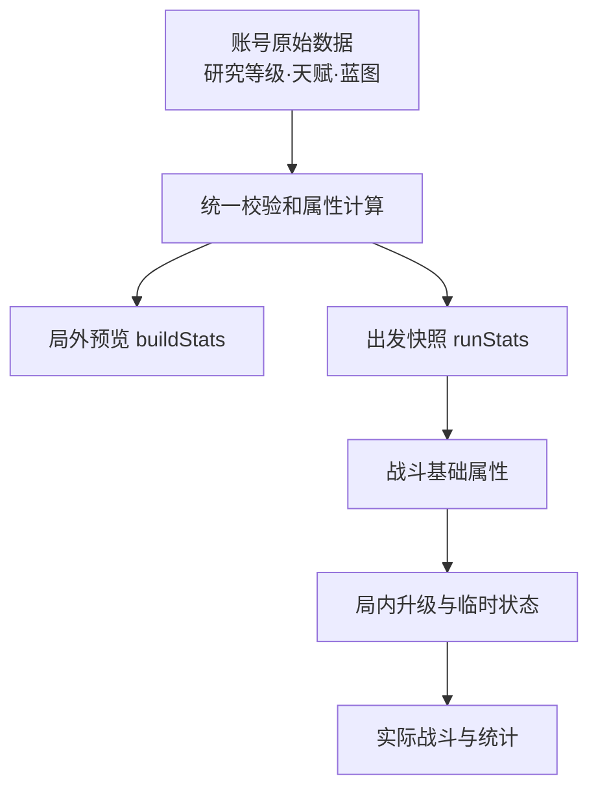

# Endless Rails v0.10.1：架构优化意见评审与修订方案

日期：2026-09-28  
范围：列车构筑、永久研究、出发属性快照、存档与结算的稳定化。本文是实施方案，不表示代码已修改或发布。

> **实施状态补记（2026-09-28，本轮实施后追加）**
>
> 1. 基线已锁定：v0.10.1 实现位于独立仓库 `ChrisGzzl/endless-rails`（非下文核对的旧 `indie-trail` 仓库），提交 `3a1f875`（已推送），`src/meta/longterm.js` 为属性单源，测试全绿。第 1 节的“版本核对限制”随之解除。
> 2. 体力自然恢复、免费/广告补给与每日 30 次上限为需求 §30-31 的**既定设计约束，当前版本尚未实现**（worklog #12 遗留）；第 6 节步骤 2 中“确认体力/补给/日上限”的预期结论是“未实现，符合范围划定”，不作为缺陷处理。

## 1. 结论与核对边界

原《v0.10.1 优化与架构问题修复建议》有一个正确判断：现阶段应稳定局外成长数据流，并把新地图、Boss、动态速度等内容留给 v0.11。但其三个迭代包直接执行并不合适：将已描述为实现的快照重新作为待建功能，按假定的目录进行大拆分，还提前制造未定义的 Run Modifier 框架。

本评审对照了原修改意见、《Endless Rails v0.10.0：列车构筑与永久研究需求》v1.1，以及可访问的 `ChrisGzzl/indie-trail` 主分支。**版本核对限制**：2026-09-28 查到的远端 `main` 是提交 [`a29c4fb`](https://github.com/ChrisGzzl/indie-trail/commit/a29c4fb0aed2776634dfef76cc08f65c9d151026)（2026-09-27），其中是根目录 `endless-rails/longterm.js`、旧版车厢编组和三级武器研究；未查到附件所称的 `src/meta/longterm.js` 或可验证的 v0.10.1 实现。因此下文将“v0.10.1 已有 `buildStats` 和 `runStats`”视作**附件及当前项目讨论提供的基线**，不是这次对远端代码的独立核验。真正实施前应先定位承载 v0.10.1 的提交或工作树，记录 commit、目录和测试状态；不要拿 v0.9 的 main 直接重构来冒充修复 v0.10.1。

## 2. 对原意见逐项裁决

| 原意见 | 裁决 | 修订理由与做法 |
|---|---|---|
| 先稳定数据流、暂缓增加大量内容 | 保留 | 与 v0.10.0 的版本边界一致；先检查现有功能是否真实生效、存档是否可恢复。 |
| 一次性拆为 `src/meta/profile/train/research/blueprint/region/migration/save` | 缩小 | 这是未经当前 v0.10.1 代码核对的目标目录。先画实际依赖与变更热点，只抽离确实重复计算或难以测试的纯函数；保持现有脚本加载和对外 API 兼容。 |
| 战斗只读 `run.buildStats`，从头建立 `buildStats` 模块 | 改为回归约束 | 按 v0.10.1 基线，局外 `buildStats` 单源、出发固化 `runStats` 已有；核验是否全链路遵守。字段名称以实际代码为准，不平行新增第二份快照。局内升级仍有自己的局内状态。 |
| 禁止 `blueprint.active` 等局外数据直接进入战斗计算 | 保留并精确定义 | 扫描战斗路径中的局外状态读取；蓝图若确有战斗效果，出发前合法归并到快照。收藏、掉落和奖励状态不能冒充战斗属性。 |
| Research“无选择”，Build 必须给单项加负面代价 | 否决示例，保留定位 | 玩家选择把多资源投向七条永久研究；Build 的 60/110 点预算、槽位、前置和互斥专精已形成取舍。额外 `+2 无人机/-15% 单体伤害` 是新机制和新平衡提案，不是架构整理。 |
| Research 在 Lv10/20/30 解锁攻速、技能、突破 | 否决 | 既定需求是七条分阶段递减的数值研究，不额外解锁武器、羁绊和突破；阈值技能会改变承诺及两周经济模型。 |
| 高速列车及耐久代价 | 延至 v0.11 | v0.10.0 明确把动力、质量、固定距离和动态速度作为整体延期；当前五段仍按既有计时行进。 |
| 预建 Region/Route/Challenge/Boss Modifier 空框架 | 不做 | 当前区域敌人系数与收益已有各自用途；敌人生成、玩家属性、结算奖励不能混装进同一个 `buildStats`。等 v0.11 的真实规则、字段和测试样例出现再抽象。 |
| 按 v0.10.1.1/.2/.3 连续交付 | 改为按风险交付 | 先修可观察错误，再做必要的局部抽取；不要以文件数量或空接口作为完成指标。 |

## 3. 本轮目标和不可改变的规则

**完成标准**：同一账号的列车方案、研究等级、蓝图效果在出发前预览、战斗、暂停、结算中一致；改装局外配置只影响下一局；旧存档、重复结算和同步重试不增加或丢失资源。若核查没有具体故障和明显重复逻辑，可以只补回归与文档，不强制改目录。

- 列车等级 Lv1 初始 2 点、每级 +2、Lv30 共 60；五分支可同时购买的有效总量 110 点，车厢槽、前置、互斥专精维持已有规则。
- 永久研究维持七项、当前最高 Lv30、分段递减收益。火力/生存资源分配是选择；不以“去重复”为由随意删除现有合法增益。
- 三套满级验收构筑为火力支援、重装续航、资源回收。只在发现实际数值重复乘算或价值混淆时调字段/文案，调平衡须另有实玩或对照样本。
- 体力自然恢复、免费 1 次、广告 2 次、每天至多出发 30 次及两周 420 次预算属于既定经济约束。本轮不因架构整理改研究费用、掉落、成功率假设和一次性成长保障。
- 近防伤害独立于无人机；羁绊、突破、普通攻击沿用已有归因。v0.11 再处理高速、距离敌潮、新地图/Boss 和挑战模式。

## 4. 属性与状态的具体边界

上图表达的是**数据所有权**，不是要求改名或新建每个框的模块。`runStats` 是这局从局外带入的基准；当前 HP、冷却、临时技能、局内无人机等级和升级选择属于本局可变状态。暂停面板与战斗应使用同一份本局有效属性计算，不从仍可修改的账号对象重新取倍率。

| 数据 | 生成/读取阶段 | 明确禁区 |
|---|---|---|
| 研究等级、天赋分配、方案、蓝图收藏/启用 | 局外保存、预览、出发校验 | 战斗逐帧直接读取账号对象来计算伤害或维修。 |
| `buildStats` 等派生局外属性 | 一处计算，供预览与出发复制 | UI 再写一套公式；序列化后当成新的永久事实。 |
| `runStats` 等出发快照 | 出发时固化并标明配置/规则版本 | 开局后受局外洗点、研究购买或切方案影响。 |
| 局内武器等级、HP、计时和一次性触发标记 | 本局独立维护 | 回写永久研究等级；刷新后重触发应急修复。 |
| 区域敌人强度/生成规则 | 当前关卡生成系统 | 塞入无人机/列车基础属性后被错误二次乘算。 |
| 地图收益、仓储失败保留、固定精度余数 | 结算账本，依据出发时方案 | 从当前局外方案重新算本局奖励；站点锁定与终局重复入账。 |

具体核查路径：

1. 搜索战斗、渲染、暂停和结算对 `meta`、`research`、`talent`、`blueprint.active` 的读取，逐一标明是 UI 展示、掉落记录还是实际数值。仅对**局内数值越界读取**修复；不要机械禁止所有文本匹配。
2. 确认预览与出发调用同一计算器。研究伤害、射程、攻速、列车耐久、减伤、维修、近防及雷达目标条件各自只在定义层应用一次；尤其核对北辰、羁绊、突破和列车近防的归因。
3. 将蓝图分为拥有记录、可用条件、启用选择和实际数值效果四种语义。v0.10.0 原需求要求基础构筑不被随机蓝图阻塞；旧蓝图的既有价值需迁移或补偿。只有已定义且允许生效的效果进入快照，不能把所有 `blueprints` 简单当统一倍率。
4. 对奖励、体力、研究购买和结算分别保持独立事务边界。战斗属性快照并不自动解决服务器/文件存档的并发、重复领奖和跨日回调。

## 5. 代码整理范围

先确认 v0.10.1 的真实目录、入口、模块约定、测试和存档格式。若仍采用静态页脚本、IIFE/全局 API 与 Node 测试兼容模式，新增模块应按当前加载方式接入；若已迁到模块化结构，按实际依赖处理。**不要先搬出十几个文件再逐一修引用。**

仅在查到下列问题时抽离对应函数：

| 触发证据 | 最小改动 |
|---|---|
| UI、出发和战斗维护同一研究/天赋公式的不同副本 | 提取一个纯属性计算函数和定义表，原入口转发调用。 |
| 洗点、买研究、方案应用存在部分扣费或非法状态 | 提取校验及原子状态转换；保持失败时账号不变。 |
| 旧存档每次加载重复迁移或退款 | 提取带版本和幂等标记的迁移函数；保留原数据备份/恢复策略。 |
| 结算和云同步重试会重复发奖 | 用唯一结算 ID、版本比较和固定精度账本修正一次性提交。 |
| 一个文件的某块纯规则已独立且频繁变更，导致测试困难 | 只抽这一块；保留现有导出、浏览器加载顺序及调用方接口。 |

`save`、`migration`、`region`、`blueprint` 是否各占一个文件，由实际复杂度和依赖决定。提取过程中保持稳定 ID、存档字段及公开 API；不得在没有兼容层的情况下仅为目录整齐而重命名。

## 6. 实施顺序与验收

| 顺序 | 工作 | 完成证据 |
|---|---|---|
| 0. 锁定基线 | 定位 v0.10.1 的提交/工作树；读 `exports/worklog.md`、实际存档样本、加载入口和现有测试；列出已实现/缺陷/不可验证项。 | 文档记录具体 commit、文件路径、关键 API；与远端旧 main 的差异说清。 |
| 1. 属性核对 | 同账号固定方案和研究，比较预览、出发快照、暂停及实际战斗；检查蓝图、雷达精英条件、伤害/维修归因。 | 关键值一致；某项局外加成各应用一次；开局后修改账号不改变本局快照。 |
| 2. 存档与经济核对 | 覆盖旧档迁移、非法点数/前置、方案草稿取消、扣费、刷新重试、站点锁定与终局、云存档冲突；确认体力/补给/日上限。 | 无负点、重复退款、重复发奖、超 30 次出发或资源丢失；原始旧档可恢复。 |
| 3. 定向修复与抽取 | 根据 1/2 的失败项修实际 bug；对重复公式或强耦合热点做最小函数拆分。 | 每个改动对应一个可复现问题或可量测维护收益；旧对外行为兼容。 |
| 4. 回归和交付 | 执行仓库现有 Node 回归、相关数值采样和 320×568、390×844 手机视口实玩；记录真机未覆盖之处。 | 三套构筑、七项研究、旧档、局内升级、结算链路通过；`worklog.md` 写明提交、结果与剩余限制。 |

建议的新增或加强断言应针对真实风险：①出发后切换局外方案/研究不改当前战斗；②蓝图效果和研究不重复乘算；③局内升级继续生效而不污染下一局；④奖励使用出发时方案，站点和终局总账只入一次；⑤旧档迁移/重试幂等；⑥三套构筑在点数、前置和车厢槽上合法。不要为文件移动本身制造镜像测试。

## 7. v0.11 接口的进入条件

现在只记录待设计问题，不建立 `challengeModifier`、`routeModifier` 等空对象。等 v0.11 同时明确固定距离、动态速度、敌潮预算、经验供给、地图目标、Boss 行为和奖励计算之后，再用一个真实地图和一个真实挑战做纵向实现，按以下职责接入：玩家基础属性来自出发快照；敌人生成和 Boss 行为由关卡规则决定；奖励倍率由结算账本决定。只有第二种真实内容复用相同转换规则时，才抽出通用 Modifier 组合机制。

**交付判断**：本轮不靠“拆成多少模块”或“预留了多少接口”验收，而看 v0.10.1 的列车构筑和研究是否一致、可恢复、可结算，并为 v0.11 留下清楚的接口边界。
